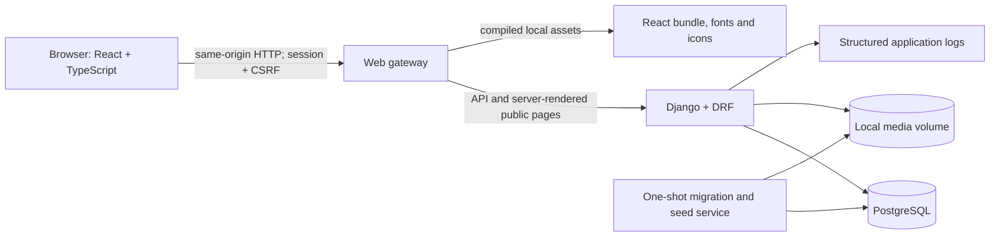
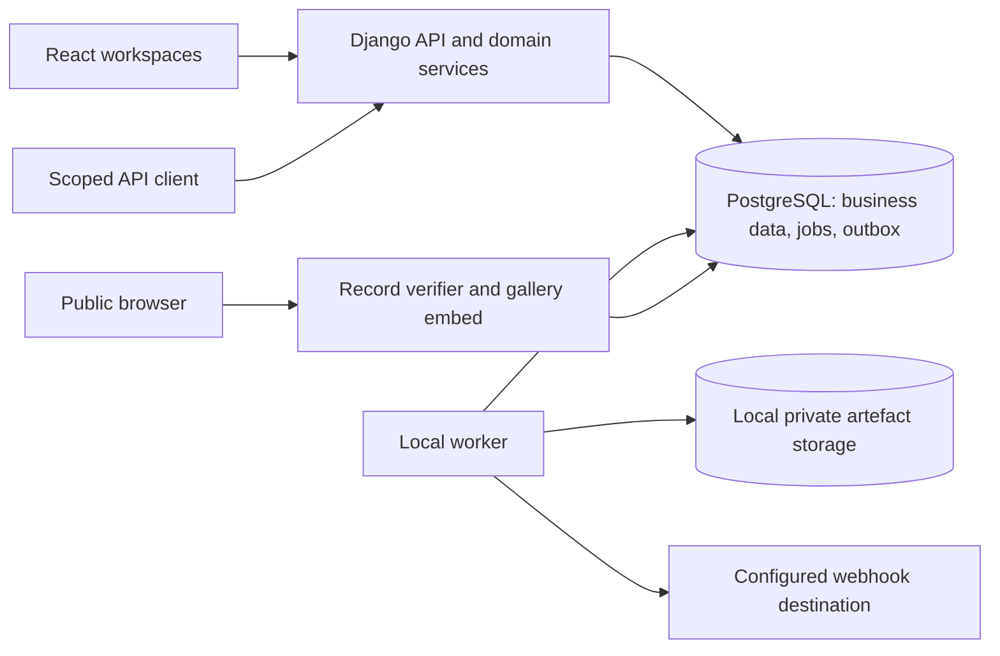

# ARCHITECTURE

Status: consolidated T1–T4 implementation blueprint, 27 September 2026. This is the sole architecture specification in the final kit. No implementation, performance benchmark, security review or tier completion is claimed.

Companion: `DATA-MODEL.md`, which specifies entities, constraints, transitions, fixture mapping and scoring inputs. If implementation changes a decision, update both documents and the relevant tests before claiming completion.

## 1. Purpose and success criteria

Build a self-hostable hackathon submission and judging portal that an unfamiliar organiser can operate. It should combine a distinctive, fast frontend with dependable submission deadlines, private judging and explainable results.

The supplied competition weights are 40% completion/correctness, 25% judging integrity, 20% adoptability/operability and 15% code quality/innovation. The full target includes T1, T2, T3 and T4. EXECUTION-PLAN.md defines verified implementation stages, beginning with T1/T2. Bonus work supports judging integrity rather than replacing tier requirements.

Product requirements agreed with the user:

- Rich event descriptions authored as Markdown with custom local images and a preview.
- Clear timeline and countdown for registration, submissions, judging and results.
- Participants work locally and submit links/files; this is not a browser coding environment.
- No participant submission or editing after the submission deadline.
- Dedicated participant, judge and organiser workspaces with an obvious next action.
- Organiser dashboard showing coverage, unfinished reviews and publication blockers.
- Strong visual design throughout the working application.
- Core operation without cloud accounts, external APIs, hosted databases or hosted authentication.

## 2. System shape

Use a modular monolith: one Django application, one PostgreSQL database and a React frontend. Separate modules by business responsibility, but keep their transactions and deployment together.



The browser never connects to the database. The frontend is built before runtime; a Node development server is not part of the deployed application. The gateway is the only service exposing a host port. PostgreSQL is private to the Compose network.

### Stack decisions

| Layer | Decision | Rationale |
|---|---|---|
| Frontend | React, TypeScript, Vite | Flexible visual design; static deployment; typed API consumption |
| Styling | Tailwind CSS plus a small accessible primitive library | Consistent spacing/colour tokens and keyboard behaviour without hand-building every primitive |
| Server state | TanStack Query | Explicit invalidation, controlled polling and distinguishable loading/error states |
| Forms | React Hook Form with schema validation | Good form ergonomics; backend remains authoritative |
| Backend | Django, Django REST Framework | Authentication, migrations, ORM and explicit domain services |
| Runtime | Supported pinned Python/Django versions | Prefer stable supported releases; resolve compatible exact versions at implementation time |
| Database | PostgreSQL | Transactions, relational constraints and predictable concurrent writes |
| App server | Gunicorn for the initial synchronous HTTP deployment | Simple process model; no WebSocket requirement |
| Gateway | Nginx | One origin; static assets, request-size limits and API proxying |
| Auth | Django database-backed sessions + CSRF | Revocable server-side sessions; no browser-localStorage bearer tokens |
| Files | Named local media volume | Offline, persistent storage with controlled download access |
| Packaging | Docker Compose | Repeatable local deployment and dependency health checks |
| Tests | Pytest/pytest-django and Playwright | Domain/transaction verification plus full browser workflows |

Pin exact versions in lockfiles and base images after checking compatibility. Do not use `latest` tags. No Redis, Celery, Kafka, Kubernetes, Elasticsearch or third-party auth is required. A PostgreSQL-backed worker is added at milestone M08 for integrations and generated artefacts. Add infrastructure only when a measured need justifies it.

## 3. Repository and module boundaries

```text
.
├── .dogfood.toml
├── acceptance-report.txt             # generated against a running release
├── docker-compose.yml
├── README.md
├── ARCHITECTURE.md
├── DATA-MODEL.md
├── JUDGING.md
├── LICENSE
├── fixtures/fixtures.json
├── tools/run.py                     # original supplied checker, unmodified
├── src/
│   ├── backend/
│   │   ├── config/
│   │   └── apps/
│   │       ├── accounts/
│   │       ├── events/
│   │       ├── teams/
│   │       ├── submissions/
│   │       ├── media_assets/
│   │       ├── judging/
│   │       ├── results/
│   │       ├── audit/
│   │       ├── imports/
│   │       ├── community/           # M05/M06
│   │       ├── integrations/        # M07/M08
│   │       ├── credentials/         # M09
│   │       ├── embeds/              # M10
│   │       └── portability/         # M10
│   └── frontend/
│       └── src/
│           ├── app/
│           ├── features/
│           ├── components/ui/
│           └── lib/
├── tests/
│   ├── domain/
│   ├── integration/
│   ├── acceptance/
│   └── e2e/
└── deploy/
    ├── nginx.conf
    ├── Dockerfile.app
    ├── Dockerfile.web
    └── release/                     # manifest/scripts, not secrets
```

Per backend module:

- `models.py`: storage shape, named DB constraints and indexes.
- `services.py`: authorised transactional mutations and transitions.
- `selectors.py`: event-scoped read queries, eager loading and projection.
- `permissions.py`: reusable request/role policy, with record checks in services/selectors.
- `serializers.py`: explicit request and response fields; never `fields='__all__'` for business objects.
- `views.py`: parse request, invoke service/selector, translate known errors.

Scoring functions live in `judging/calculation.py` as deterministic functions over immutable input data. They do not import HTTP request objects or perform hidden ORM writes. Import mapping belongs in `imports/`, not in model signals.

Shared upload storage and access checks belong in `media_assets/`. Core rate-limit storage belongs in `accounts/`; community endpoints reuse it when T3 is implemented. T3 is not a prerequisite for protecting login or uploads.

Avoid a generic base service/repository layer. Django's ORM already provides data access. Use explicit functions such as `submit_project`, `assign_judge`, `submit_review`, `build_result_run` and `publish_results` with visible arguments and rules.

## 4. Frontend experience and navigation

User-selected references: [DOGFOOD](https://dogfoodhack.com/) and [Vercel](https://vercel.com/). Use Vercel as the primary visual reference for a restrained product interface, and DOGFOOD as the reference for bold event presentation and explicit event stages. This is a proposed synthesis of the user's references, not a pixel-for-pixel reproduction or an assertion that every reference-site visual has been inspected. These are design references only; Vercel hosting is not a runtime dependency.

This direction supersedes the earlier warm-surface/electric-lime palette proposal. Start with a neutral monochrome system: near-white workspace background (`#FAFAFA`), white panels, near-black primary text (`#171717`), muted text (`#666666`) and thin neutral borders (`#E5E5E5`). Use an inverse near-black surface (`#0A0A0A`) for the public event hero and selected navigation surfaces. Reserve blue (`#2563EB`) for focused/selected interactions and semantic colours for success, warning and error. Verify actual text/background contrast in implementation; token names are not accessibility evidence.

Use large, confident event headings, a visible column grid, generous whitespace, compact metadata labels and a strong primary action. Public event pages can have more expressive typography and local cover artwork. Participant/judge/organiser workspaces use quieter composition, legible tables and compact controls so repeated tasks stay comfortable. Avoid decorative effects behind score inputs or critical deadlines.

Typography: one locally bundled sans-serif family for interface/body text and an optional local monospace family for phase labels, timestamps and identifiers. Use modest 6–10 px corner radii, 1 px borders and subtle shadows only where they clarify elevation. Motion should support state changes, remain short (roughly 120–180 ms), and honour reduced-motion settings. No essential information is communicated through motion alone.

Build a shared design-token and component layer for buttons, fields, tabs, status badges, cards, tables, dialogs, empty states and next-action panels. Check it at approximately 390 px mobile and 1440 px desktop widths. Reference quality must extend through errors, loading, saved states and confirmation receipts. All fonts, icons and decorative assets ship locally.

| Surface | Main purpose | Primary action |
|---|---|---|
| Event overview | Cover, Markdown description, rules, prizes, rubric and phase timeline | Join event or view current status |
| Gallery | Search/filter submitted projects; attractive cards | Open project |
| Project detail | Official submitted description, images, repo/demo references | Return to gallery; community action if enabled |
| Participant workspace | Team members, invitations, draft editor and submission receipt | Complete missing fields / submit / view receipt |
| Judge workspace | Assigned queue, project evidence and rubric form | Continue next incomplete review |
| Organiser dashboard | Coverage, missing reviews, time remaining and blockers | Resolve the highest-priority blocker |
| Event settings | Content, dates, tracks, prizes and rubric | Save/publish configuration |
| Results | Released standings, methodology and limitations | Inspect published outcomes |
| Account routes | Sign in, register, accept invitation, sign out | Complete authentication |

These are information surfaces, not a fixed page-count target. Shared layouts and nested routes can combine them without hiding essential workflows.

### Next-action contract

`GET /api/v1/events/{event_id}/me/next-action` returns a server-derived action, not arbitrary generated advice:

```json
{
  "code": "SUBMISSION_INCOMPLETE",
  "label": "Complete your submission",
  "reason": "Add a repository link or supporting file.",
  "href": "/events/example/workspace/submission",
  "deadline_at": "2026-09-29T18:00:00Z",
  "server_now": "2026-09-28T10:00:00Z",
  "blocking_items": ["project_evidence"],
  "state_version": 12
}
```

Allowed codes and internal hrefs are defined by the application. Never accept a client-provided role or arbitrary redirect target. Priority is role-specific: membership/team setup, missing required content, explicit submission, unfinished reviews, publication blockers. A non-captain participant sees “Ask your captain to submit” when that is the real next step.

After deadline, actions become read-only status or results actions. A submitted project with newer draft edits shows “Submit your changes” while open, and explains after close that only the last submitted version counts.

### UX rules

- Show `Saving…`, `Saved`, `Unsubmitted changes` and `Save failed` distinctly. A failed save never produces a success toast.
- Debounced draft autosave uses parent version numbers. Preserve local text on 409 and offer reload/copy/reconciliation; no silent last-write-wins.
- Explicit submission returns a receipt with project ID, revision number and authoritative timestamp. A spinner is not a receipt.
- Never optimistically mark submission, scoring completion or result publication as successful before server confirmation.
- Countdown uses server clock offset and periodically resynchronises. It does not grant permission.
- When close is reached, disable editing and preserve unsaved browser text for copying; the server rejects late saves regardless.
- Do not persist sensitive review drafts in shared-browser local storage by default. Keep unsaved text in memory until saved; warn before navigation when necessary.
- Keyboard navigation, visible focus, labelled forms, error summaries, adequate contrast and reduced-motion support are acceptance conditions.
- Judge forms show only the assigned judge's work. Public progress shows aggregate completion only when enabled and when the denominator is known.

## 5. HTTP and permission boundaries

API root: `/api/v1`. All mutation endpoints require a valid session, CSRF protection and explicit authorisation, except narrowly defined authentication/registration endpoints which still use CSRF protection and rate limits. Login must explicitly enforce CSRF; do not assume DRF's authenticated-session check covers anonymous login requests.

Examples below define intent; use these route names consistently in implementation unless deliberately updated everywhere.

| Endpoint | Method | Policy |
|---|---|---|
| `/auth/session` | GET | Current user and CSRF bootstrap; no secret cookie contents |
| `/auth/login`, `/auth/logout` | POST | CSRF-protected; rate-limited; rotate session at login |
| `/events/{id}` | GET | Public projection for published event |
| `/events/{id}/projects` | GET | Public submitted revisions; pagination/search/track filter |
| `/events/{id}/projects` | POST | Active participant, own team, open window; create draft |
| `/projects/{id}/draft` | PATCH | Own team, matching version, open window |
| `/projects/{id}/submit` | POST | Captain, valid complete revision, open window |
| `/events/{id}/judging/assignments` | GET | Judge's own queue or organiser-scoped projection |
| `/assignments/{id}/review` | GET/PUT | Assigned judge; write only within judging window |
| `/assignments/{id}/review/submit` | POST | Complete valid rubric; assigned judge |
| `/events/{id}/judges/{judge_user_id}/scores` | GET | Same judge or event organiser; peers get 403 |
| `/events/{id}/organiser/progress` | GET | Event organiser; private coverage only |
| `/events/{id}/results/preview` | POST | Organiser; calculate and persist private result run |
| `/events/{id}/results/publish` | POST | Organiser; fresh run, windows closed, blockers resolved |
| `/events/{id}/results` | GET | Public active publication only |
| `/events/{id}/exports/results.csv` | GET | Event organiser; explicit export audit |
| `/assets/{id}/download` | GET | Resolve access from event/project/revision visibility |

Do not allow score endpoint access merely because a user has any judge role somewhere. Every request checks the target event and active membership. A participant's attempt to access judging endpoints returns 403. For private IDs outside an actor's visibility, 404 is appropriate; the explicitly configured peer-score probe must return 401/403 to match the checker.

Public responses use dedicated serialisers that cannot include private drafts, scores, user emails, invitation tokens, unpublished aggregates or moderation internals. Judge queue selectors never join peer reviews. Organiser full-review views include submitted reviews only.

Permissions must protect list queries, detail requests, nested resources, imports and exports. DRF object checks alone do not filter list endpoints or validate object creation. [DRF permissions](https://www.django-rest-framework.org/api-guide/permissions/).

### Error and concurrency contract

```json
{
  "error": {
    "code": "SUBMISSIONS_CLOSED",
    "message": "Submissions closed at the event deadline.",
    "fields": {},
    "request_id": "opaque-request-id"
  }
}
```

Use 400 for invalid fields, 403 for forbidden/window-closed actions, 404 for unavailable objects, 409 for stale versions/state conflicts, 413 for upload limits, 429 for rate limits and 503 for a genuinely unavailable dependency. Auth failures may be 401 or 403 as appropriate to the configured session authentication. No stack traces or SQL details in responses.

## 6. Critical write paths

### Participant submission

1. Browser uploads allowed files to staging and saves draft revisions while the event is open.
2. Captain requests submission of the current version.
3. Service starts an atomic transaction, locks Event then Project/Team in the documented order, and rechecks active membership, captainship and expected version.
4. Validate required content, attached file readiness, team-size rules and matching track/event. Snapshot the current roster.
5. Read fresh database wall-clock time after lock acquisition and validation. Reject at or after close.
6. Set official submitted revision and receipt timestamps, increment project/event versions, append audit, commit.
7. Invalidate gallery/workspace queries only after success.

This prevents a stale form, manipulated browser clock or upload started before cutoff from bypassing the deadline. The final transactional check defines acceptance; network arrival time does not.

### Judge review

1. Select assignment from the judge's event- and permitted-track-scoped queue.
2. Load pinned submitted revision and frozen rubric, never a participant's newer unsent draft.
3. Save partial drafts with optimistic version checks.
4. On submit, validate all criterion values and the exact criterion set; recheck judge/assignment/window under the event lock.
5. Persist current scores and an immutable review revision, increment data version and append audit atomically.
6. Return completion to the judge and invalidate organiser progress. Do not disclose rankings to the judge.

### Assignment strategy

Use a deterministic greedy baseline: eligible projects with least review coverage first; prefer judges with matching expertise, then lowest active load; break scheduling ties by stable IDs. Exclude conflicts, existing active judge/project pairs and judges without an explicit JudgeTrackPermission for the submitted track. Expertise preference never overrides the access grant. Preview the assignment changes before applying them atomically.

Aim for at least the configured required reviews per project and useful reviewer overlap in each ranking cohort. A shortage is an explicit dashboard blocker, not permission to silently reduce coverage. Expertise is a preference unless the organiser explicitly configures stricter allocation later.

Fixture assignments are reconstructed only from observed reviews and marked with their origin. Preserve source reviews outside declared track scope on QUARANTINED assignments; organisers explicitly reconcile grants/assignments with a reason before they enter current ranking or judge queues. The absence of source assignment lists means imported completion coverage is unknown. A separate demo event may contain explicitly synthetic pending assignments to exercise the dashboard.

### Results publication

1. Snapshot eligible submitted projects, complete valid review revisions, rubric/configuration and coverage at event data version N.
2. Calculate outside the write lock using the pure deterministic algorithm in `DATA-MODEL.md`.
3. Store an immutable result run and rows with diagnostics and input/output hashes.
4. Organiser reviews raw/adjusted scores, counts, excluded duplicates and unresolved warnings.
5. Publication transaction checks that data version remains N and judging/voting windows have closed, and records any permissible explicit waivers.
6. Insert publication, set active publication pointer and judging freeze, append audit, commit.
7. Public results switch to this snapshot. No live recalculation on public page loads.

The system must distinguish hard errors (invalid inputs, non-convergence, stale run) from waivable evidence limitations (undercoverage or disconnected comparisons). Waivers need an explanation visible alongside published methodology; they do not turn missing data into scores.

## 7. Normalisation and integrity

Use weighted criterion means and the versioned regularised judge-offset method defined in the data model. Preserve raw inputs, raw means, adjusted index values and exact configuration. Constant-score judges and incomplete assignments must have deliberate behaviour.

The supplied `fixtures.json` is the primary integration dataset, including its 41 project records, 126 reviews and duplicate. It is not an expected-answer file: it supplies no authoritative normalised ranking. Validate import and full application behaviour with the unchanged fixture, then validate the maths with small hand-checkable cases and an independently solved linear system. Add controlled test inputs for missing reviews/assignments rather than altering the original file. This combines realistic data with a trustworthy correctness check.

Do not claim this model establishes objective fairness. It estimates additive judge offsets under explicit assumptions. Sparse overlap and disconnected review groups limit what can be inferred. The product should show those limitations clearly enough for an organiser to decide whether to obtain more reviews.

`JUDGING.md` must include equations, parameter rationale, tie policy, eligibility rules, sparse/constant-score handling, connected-component diagnostics and reproducible fixture outputs. A normalisation bonus claim requires implemented evidence and independent numerical checks, not this design document alone.

A score-explanation panel should answer:

- Which submitted version was judged?
- How many complete reviews contributed?
- What weights and algorithm version were used?
- How does the raw mean differ from the adjusted value?
- What evidence limitations or organiser waivers apply?

Only organisers see individual judge identities and submitted private reviews. Public explanations contain aggregate published data and limitations.

## 8. Offline deployment and seed behaviour

Compose services:

Docker Compose is the user-confirmed required deployment path. A hosted preview can be supplementary, but the deliverable remains the seeded local application started by `docker compose up` using the offline preparation described below.

| Service | Responsibility | Persistent state |
|---|---|---|
| `db` | PostgreSQL with readiness check | `db_data` volume |
| `init` | One-shot migrations, idempotent fixture/demo seed, checker-session provisioning | DB; protected local seed configuration where needed |
| `app` | Django/Gunicorn API and small server-rendered public pages | `media_data` volume |
| `web` | Nginx static frontend and reverse proxy | Built assets inside image |

`init` uses the same backend image as `app`, starts only after database health, and must complete successfully before application readiness. Do not run migrations independently in every web worker. Failed initialisation stops readiness and reports the reason.

Expose `http://localhost:8080` by default. Bind to loopback for the demo; deliberate production binding/HTTPS configuration is documented separately. Use health checks for database connectivity and migration readiness, and a liveness endpoint that does not require optional services.

### What offline means

`docker compose up` must start the seeded portal with the network disabled once release images have been transferred/imported onto the laptop. An empty laptop cannot obtain Docker or absent images from nowhere. The supplied brief does not specify the offline image handover procedure, so package it explicitly and document the assumption rather than hiding it.

Deliver an offline release archive containing pinned app/web/PostgreSQL images and a checksum manifest, with the documented `docker load` preparation step. The acceptance Compose file references those local images with `pull_policy: never` and has no runtime package installation or network build requirement. Provide an explicit online development/build workflow separately. Compose's pull policy controls whether an absent image causes a pull or a failure. [Docker Compose service reference](https://docs.docker.com/reference/compose-file/services/#pull_policy).

Vendor the compiled frontend, fonts, icon assets and required Python dependencies into images. Do not load CDN scripts/fonts, fetch repository previews, require SMTP, or call cloud APIs. Missing local images must produce an actionable setup failure.

### Seeds and authentication

- Import the original fixtures once and preserve their original closed submission timestamp.
- Repeated startup never deletes user edits, rewrites deadlines or regenerates fixture history.
- Create a separate open demo event on first seed; clearly distinguish it from the fixture event.
- Use normal Django users and sessions for checker identities: organiser, judge A, judge B and participant. Do not create a special role-spoofing header accepted by middleware.
- Provision these sessions only in explicit local demo/checker mode, display the actual request headers in local seed output, and give them a configurable lifetime covering the judging period. Do not log them on normal requests or commit live deployment credentials.
- A local demo profile may use documented demo-only accounts. Production mode disables them, requires a configured secret and never reuses fixture sessions.
- The `.dogfood.toml` headers are credentials for an intentionally isolated local demo. Regenerate them if sessions expire; do not weaken normal auth to preserve a stale configuration file.

## 9. Acceptance checker integration

Keep the supplied `run.py` unchanged. It executes six HTTP requests for seven checks, because the public gallery response is reused for fixture-title inspection. It does not execute JavaScript.

Inspected checker SHA-256: `aa98963841bc8e18e8e5d76f0499697c093dd3c0055f9d73a459f592f4dcf09d`. These observations apply to that version; recheck them if the organisers replace the file.

Provide a small server-rendered `/events/{fixture_slug}/projects` gallery route with real submitted project titles and links. React can enhance navigation, but the initial HTTP body must include a recognised fixture title. A separate client-only empty application shell will fail that check.

The public gallery selector is shared between HTML and JSON responses so the checker view cannot become a hardcoded alternate product. Ensure its initial page contains at least one of `Glass Signal`, `Small Meadow` or `Deep Compass` through legitimate deterministic ordering or suitable page size.

Configuration template; replace placeholders with actual seeded IDs and valid session headers:

```toml
[portal]
base_url = "http://localhost:8080"

[tiers]
claimed = ["T1", "T2"] # only retain after full feature verification
pitch = "A self-hosted hackathon portal with transparent, auditable judging."

[auth]
organizer = "Cookie: sessionid=<local-demo-organiser-session>"
judge_a = "Cookie: sessionid=<local-demo-judge-a-session>"
judge_b = "Cookie: sessionid=<local-demo-judge-b-session>"
participant = "Cookie: sessionid=<local-demo-participant-session>"

[routes]
gallery = "/events/<fixture-slug>/projects"
submit = "/api/v1/events/<fixture-event-id>/projects"
judge_scores = "/api/v1/events/<fixture-event-id>/judges/<judge-a-user-id>/scores"
peer_scores = "/api/v1/events/<fixture-event-id>/judges/<judge-a-user-id>/scores"
csv_export = "/api/v1/events/<fixture-event-id>/exports/results.csv"
```

The same own/peer URL is intentional: it names judge A, first read as A and then probed as B. Both seed judges must have active membership in the fixture event and distinct sessions. The participant must be an active fixture participant.

The checker sends a POST without a CSRF token. Retain CSRF protection. A 403 may therefore satisfy its closed-event probe without exercising deadline code; document that limitation and separately test a valid authenticated, CSRF-compliant late submission that fails specifically with `SUBMISSIONS_CLOSED`. Do not disable protection or special-case the probe to obtain a pass.

CSV export can report provisional calculations before publication to an organiser, with clear status and algorithm/coverage columns; it is not gated on a public result release. Ordinary public and judge roles cannot retrieve it.

Run:

```sh
python tools/run.py .dogfood.toml --fixtures fixtures/fixtures.json > acceptance-report.txt
```

Important limitations:

- Any 4xx passes the late-submission probe, even if the cause is unrelated to the deadline.
- CSV validation only looks for HTTP 200 and a comma in the first line.
- T3/T4 have no checks in the supplied script. It cannot verify beyond T2 and will flag higher claims as unverified.
- The script returns exit code 0 even if checks fail. CI must inspect its report or use an independent wrapper that detects FAIL lines; keep the original file intact.

A green report is necessary evidence, not the whole acceptance definition. Commit the generated report honestly; never prewrite PASS output. If T3 is implemented, record its separate evidence and the checker's scope limitation rather than changing the checker to imply official verification.

## 10. Security and privacy boundaries

| Risk | Required control |
|---|---|
| Peer-score exposure | Scoped selectors, explicit serialisers, role/object tests on all read paths |
| Cross-event access | Membership checks against the target event, including nested resource creation |
| CSRF/session theft | CSRF on mutations/login; HttpOnly cookies; SameSite policy; Secure cookies under HTTPS |
| Markdown injection | Disable raw HTML, sanitise rendered HTML, permit safe URL schemes only |
| File/path abuse | Size/signature checks, random storage keys, controlled downloads, no archive extraction |
| Deadline bypass | Fresh authoritative timestamp inside locked service transaction |
| Lost edits | Version preconditions and conflict UI |
| Unpublished result leakage | Dedicated public projections; private/no-store cache headers on sensitive endpoints |
| Formula injection | Escape untrusted CSV text cells, preserve faithful JSON export separately |
| Brute force/abuse | Enforced shared rate limits and bounded logs; do not rely on browser throttles |
| SSRF | No server-side fetching of arbitrary submitted URLs or remote Markdown images |
| Secret leakage | No committed runtime secrets or production tokens; redact logs and export payloads |

Event/project Markdown images must use approved local assets. External hyperlinks are allowed as references but never needed for application operation. Configure a restrictive Content Security Policy compatible with local assets and explicit `Referrer-Policy`/`X-Content-Type-Options` headers.

Django admin is a maintenance tool, not the user-facing organiser dashboard. Disable direct editing of immutable/frozen business models and provide service-backed actions for exceptional operations. A convenient admin form must not bypass submission or judging rules.

## 11. Performance and live progress

These are initial targets to measure, not achieved claims:

- With a warm local app, paginated gallery and dashboard reads: p95 below 300 ms at 20 concurrent users on a documented test laptop.
- Ordinary draft/score writes: p95 below 500 ms excluding file transfer, with correctness checks still enabled.
- Route transitions should promptly show meaningful loading feedback rather than a frozen screen.
- Fixture result calculation should complete within 2 seconds on the documented test laptop; revise the target transparently if measurement disagrees.

Measure database query count, endpoint latency and browser interaction before optimisation. Use `select_related`/`prefetch_related` for bounded relational views, aggregate progress in SQL and paginate lists. Return compact public cards rather than complete reviews/submission history.

Poll organiser progress every 10 seconds while its tab is visible; back off on errors and pause while hidden. Polling is enough for “judging is 68% complete” and avoids WebSocket infrastructure. Counters derive from assignments and complete reviews, not simulated activity.

When assignment coverage is unknown for imported data, show completed recorded reviews and “assignment coverage unavailable”. Never display a fabricated percentage. Public judging progress, if enabled, contains aggregate counts only and never live judge/project identities or score totals.

Cache hashed static assets aggressively. Sensitive API responses use private/no-store policies. Keep public data cache invalidation explicit after submission/publication; do not put authenticated responses into a shared cache.

The event-wide write lock deliberately favours simple correctness at hackathon scale. Instrument lock wait time. Narrow locking only when measured contention and tests justify a more complex versioning scheme.

## 12. Operations, backup and recovery

Structured logs include request ID, event ID where appropriate, route, status and latency. Exclude private review text, passwords, raw invite tokens and session headers. Log application errors and seed failures clearly. Database credentials and secret keys stay in environment/configuration outside the public repo.

Persist database and media separately. A backup is a consistent PostgreSQL dump plus matching media and a release/schema manifest. During a simple backup, enable maintenance mode for writes, capture both, then resume. A database-only backup is incomplete.

Provide documented commands for: seed validation, fixture import, session provisioning, result recalculation, staged-file cleanup, database backup and restore. Destructive reset is an explicit development command, never part of startup.

Test restoration into fresh volumes: authenticate, open uploaded images, inspect official submissions, and reproduce a published run. Migration failure must preserve the old database and report the failed migration. Schema changes are additive where practical; take a backup before destructive migrations.

## 13. Verification plan

Use PostgreSQL for integration tests, especially locks and constraints. SQLite cannot stand in for those behaviours. Django transactional locking tests need real transaction boundaries. [Django QuerySet reference](https://docs.djangoproject.com/en/5.2/ref/models/querysets/#select-for-update).

| Layer | Required evidence |
|---|---|
| Pure domain tests | Weighted scoring, deterministic adjustment, ties, constant scores, missing reviews, disconnected groups |
| Database tests | Unique/partial constraints, rollback, stale versions, concurrent joins/submissions |
| Permission tests | Role matrix across events, peer-score probes, exports, nested resources and assets |
| Deadline tests | Before/equal/after boundaries, lock waits crossing cutoff, valid-CSRF late POST, staged upload after close |
| Fixture tests | Exact source counts, duplicate preservation, closed date, equal-weight provenance, idempotent import |
| API tests | Complete workflow and structured errors using real sessions and CSRF |
| Browser tests | Create event, invite team, draft/autosave, submit, judge, inspect blockers, publish |
| Visual/accessibility review | Main screens at desktop/mobile widths, keyboard paths, contrast, reduced motion, error/empty states |
| Release tests | Fresh volumes, restart persistence, offline start from loaded images, backup restore |
| Supplied acceptance | Unmodified checker output saved as acceptance-report.txt |

Test real behaviour rather than merely mirroring helper implementation. The independent numerical check for normalisation is especially important. Keep the original fixture and checker as immutable test inputs with recorded checksums.

## 14. Implementation staging

EXECUTION-PLAN.md is the sole milestone order and scope authority. Read the complete design once, then implement only the current authorised milestone. DATA-MODEL.md is the sole field/constraint authority. REQUIREMENTS-MATRIX.md maps every tier requirement to its milestone and evidence.

Use explicit domain services, preserve original fixture/checker bytes and maintain IMPLEMENTATION-STATUS.md after every milestone. Do not create dormant later-tier infrastructure in the foundation. Architecture module names describe eventual ownership, not permission to implement all modules at once.

## 15. Decision record

| Decision | Alternative considered | Why this choice |
|---|---|---|
| Modular Django monolith | Microservices | One team, one transaction boundary and one deployable product |
| React frontend | Django templates for every screen | Greater flexibility for the requested interactive design; accept an explicit API boundary |
| Small server-rendered public gallery | Client-only shell everywhere | Public content is available to the supplied non-JavaScript checker and simple HTTP clients |
| PostgreSQL | SQLite in production | Reliable concurrent constraints/locking and consistent integration environment |
| Session cookies | Browser-stored JWTs | Straightforward revocation and one-origin auth without token refresh infrastructure |
| Immutable submission/result snapshots | Overwriting submitted content/live leaderboards | Stable judging evidence, clear audit history and reproducible publication |
| Regularised judge offsets | Naive per-judge z-scores | No zero-variance division and explicit shrinkage for sparse reviews; comparability limits remain visible |
| Polling | WebSockets | Sufficient progress freshness with fewer runtime components |
| Local media | Hosted object storage | Offline adoption requirement |
| Authenticated voting default, optional invite/email gates | Mandatory SMTP for all voters | Default works offline; other gates have explicit capability and identity limits |

## 16. Honest release checklist

Before submitting, replace this document's proposed-status notice with a dated implementation-status section that identifies completed milestones and limitations. Do not delete unsupported limitations merely to make the entry look complete.

The repository still needs a runnable implementation, README, JUDGING, LICENSE, tests, generated acceptance report, real `.dogfood.toml` and the user's five-minute demo video. This final kit is a planning deliverable, not a finished submission. README.md is explicitly a kit README and must be replaced with tested application instructions at release.

All decisions about schema, routes, upload limits, role exclusivity and normalisation parameters are our implementation choices. They must satisfy the supplied brief, but they must not be presented as rules imposed by the organisers.

## 17. Architecture additions

Keep Django/DRF, React/TypeScript/Vite and PostgreSQL. Add backend modules `community`, `integrations`, `credentials`, `embeds` and `portability` as their milestones arrive.

Add a `worker` Compose service using the same backend image. It runs a Django management command that claims due database jobs and webhook deliveries. No Redis or external queue is required for the full release.



Outbound webhook delivery is optional and asynchronous. A disconnected or failing destination must not block submissions, judging, votes or publication. Offline demonstrations use an explicitly configured receiver on the local Compose network.

Keep existing event mutation locks for eligibility/publication changes. Workers claim queue rows in short transactions, release locks before I/O, and use leases. Never keep an event lock open during PDF rendering, archive creation, email sending or HTTP delivery.


## 18. T3: voting model and gate policies

Schema: use the final T3 entities in DATA-MODEL.md section 11.

### Deliberate ballot rule

Use approval voting: one support vote per eligible project per voter identity. A person may support several projects. Do not label this a single-choice election or combine it with judged scores. Judge rankings and community choice remain separate result sections.

Signed-in identities cannot vote for a project whose official roster contains their user ID, even if they later leave the team. For an unmapped invite/email identity, self-team detection is incomplete; disclose that limitation and allow organiser review rather than claim proof of independence.

Votes can be withdrawn/re-added within the window. Retain one row per identity/project with audited state transitions; duplicate POSTs return the same active state. A voter cannot reactivate an organiser-voided vote. Only an organiser can restore it with a reason.

### Access modes

| Mode | Identity proof and offline behaviour | Known limitation |
|---|---|---|
| AUTHENTICATED | Existing signed-in account; works fully offline | Multiple accounts can represent one person |
| INVITE_LINK | Organiser-issued single-use random link exchanged for a restricted HttpOnly voter session | Link possession is transferable; one issued link is not proof of a unique human |
| EMAIL_VERIFIED | Expiring token delivered to an address; redeem to a restricted voter session | One mailbox is not necessarily one human; actual delivery needs configured SMTP |

Choose AUTHENTICATED by default. Freeze mode and identity policy before the window opens. A policy cannot be switched mid-vote to evade deduplication. Any reset before opening is explicit and audited.

Email delivery is an optional configured feature, not a dependency of application startup or authenticated voting. Offer a self-hosted/local development mail inbox for offline demonstration, visibly labelled as a demo. Real email mode must remain unavailable until an organiser configures a reachable SMTP service. Never label organiser-approved identities “email verified” or expose verification tokens in production UI/logs.

Link/email voter sessions have voting permissions only. They cannot access participant projects, judging or organiser endpoints. They are CSRF-protected, expire, and are revoked when the identity/grant is suspended. Redact tokens from URLs in logs; exchange then redirect to a token-free URL.

### Voting write transaction

1. Lock Event; resolve active permitted voter identity and project from this event.
2. Require a published event, eligible officially submitted project and fresh time `voting_opens_at <= now < voting_closes_at`.
3. Apply gate policy and known self-team check, then shared rate limits.
4. Create/update the unique vote row. A repeated vote does not increase the count.
5. Increment event data version and write a non-sensitive audit event atomically.
6. Respond with the actor's own vote state, never an aggregate total.

After close, the voter cannot create, withdraw or reactivate votes. Organisers can void/restore votes for documented abuse before a publication snapshot. Changes after publication require a new snapshot and superseding publication; never mutate previously published counts.


## 19. T3: ballot ordering and result secrecy

When the voter opens a ballot, snapshot currently eligible project IDs and generate a cryptographically random ordering seed. Produce an unbiased Fisher–Yates shuffle using a seeded generator suitable for this deterministic ordering task. Store the resulting ordering or derive it consistently from the same seed. Do not seed from vote totals, rank, time remaining or a client-controlled parameter.

Pagination traverses that fixed order. Refreshing or logging into another device returns the same current identity ballot; it must not regenerate order until the ballot expires or an explicit eligibility-version change requires it. A different voter normally receives a different order. Do not promise equal exposure from randomisation alone.

New competitive submissions do not appear during voting because the submission window has already closed. If eligibility changes, retain order for remaining projects, remove disqualified entries and show an availability notice; explicitly reconcile any newly eligible entries and record the ballot version rather than reshuffle silently.

Before explicit results publication, public endpoints may show the requesting voter's own support state and eligibility, but no project vote totals, community ranks, judged rankings or private scores. Audit these boundaries across HTML, JSON, sorting, exports, preload data, embeds, webhooks and error responses. Organiser-only counters use private/no-store responses.

At publication, include a vote input snapshot/digest, policy version, counted/voided states and eligibility decisions in `ResultRun`. Store community totals in `CommunityResultRow`. Rank by counted votes descending with competition ties (1, 1, 3). Keep identity lists private. A snapshot with no votes shows “No community votes recorded”, not invented winners.

The existing rule remains: publication waits for both configured judging and voting windows to close. A elapsed window alone does not automatically release results.


## 20. T3: comments, moderation and abuse controls

Use Comment, AbuseSignal and ModerationCase as defined in DATA-MODEL.md.

Comment content is plain text, maximum 5,000 characters. Render as text; do not interpret submitted HTML. Authors may edit within the configured comment window and delete their own comments later. Organisers can hide/restore with a reason. A deleted body is removed; audit retains action metadata rather than indefinitely duplicating the removed text. Users cannot edit hidden/deleted comments back into public visibility.

Comments require signed-in accounts even when voting uses an invite/email gate. This is a deliberate policy shown in the UI. Voting credentials do not automatically become general accounts.

Initial configurable enforced limits:

| Action | Default limit | Scope |
|---|---:|---|
| Vote transitions | 60 per minute | Voter identity/event; coarse network limit supplements it |
| New comments | 5 per minute, 50 per day | Account/event |
| Email challenges | 3 per hour/address, 20 per hour/network key | Both limits enforced |
| Invalid link redemptions | 10 per 10 minutes | Network key, plus grant where known |
| Reports | 10 per hour | Account/event |

Use the shared DB `RateLimitBucket`, with atomic updates across workers and Retry-After responses. Rate limits are not identity proof. A network-wide limit must be configurable for shared school/office networks; never void votes solely because people share an IP.

Signals: rapid account creation followed by coordinated votes, excessive failed tokens, repeated content, repeated source-repository submissions and unusual voting bursts. Signals create review cases, not automatic guilt. Avoid hidden device fingerprinting.

Moderator actions: dismiss signal, hide comment, suspend a voter identity, void a specified set of votes, restore a previous decision. Each decision names the actor, affected IDs, reason and time. Bulk actions preview exact scope before confirmation. Never retroactively apply a changed account-age rule to invalidate existing votes without explicit review.

Use rotating keyed network hashes, retain detailed network signals for 30 days by default and then remove them with a maintenance job. Keep necessary decision/audit metadata without raw IPs or challenge tokens. Document this retention policy in event settings/privacy copy.

Frontend additions: project discussion; ballot with “Supported” state but no counters; access-mode setup; organiser moderation inbox; private voting progress; publication summary showing vote exclusions. Empty/error/expired-token states must explain recovery.


## 21. T4: complete REST API and local documentation

Keep `/api/v1` for compatible additions. API version and product release number are independent: A new product release does not automatically require `/api/v2`. Introduce a new API major version only for incompatible contracts.

Publish a machine-readable OpenAPI 3.1 document at `/api/v1/schema.json` and locally bundled interactive docs at `/api/docs`. Document request/response shapes, enums, authentication, permissions, pagination, version preconditions, error codes, file limits and idempotency. Do not depend on CDN-hosted docs assets. [OpenAPI specification](https://spec.openapis.org/oas/v3.1.1.html).

### API keys

Use ApiCredential from DATA-MODEL.md. Show a high-entropy token once; store only its digest. `event_id` is required: no global wildcard keys in this release.

Scopes: `event:read`, `event:manage`, `team:manage`, `submission:write`, `judging:write`, `results:publish`, `community:moderate`, `integrations:manage`, `credentials:issue`, `data:export`, `data:import`. Effective permission is always the intersection of key scope, owner's current role, event membership and object access. A scope cannot elevate a participant into an organiser. Suspended users, revoked roles or expired keys immediately lose access.

The first organiser may create an event using normal session auth; an event-scoped key manages only its existing event. Identity/session bootstrap is documented separately from event API actions.

Separate session and bearer authentication clearly. Cookie-authenticated requests require CSRF. Bearer-only endpoints do not accept a cookie as an implicit fallback and do not require CSRF merely for using an explicit Authorization header. Reject ambiguous mixed identities rather than choose whichever has more privilege.

Create an `API-COVERAGE.md` inventory mapping every business action exposed by the UI to its API route/service and permission test: content/settings, tracks/prizes, invitations, teams, drafts, uploads, submit/withdraw, rubric freeze, assignments, reviews, result preview/release, votes, comments, moderation, webhooks, certificates, embed settings, imports/exports. Pure navigation and login/logout are documented separately. Do not claim “API first” while core actions exist only in HTML views or admin forms.

### Idempotency and bounded operations

Use IdempotencyRecord from DATA-MODEL.md for publication, bulk jobs, certificate issuance and invitation batches. Same key/same request returns the existing operation; same key/different payload returns 409. Expire ordinary records after 24 hours; durable job/entity uniqueness still prevents duplicate work later.

Lists default to 25 and cap at 100 items; use stable cursor pagination. Bulk requests default to a maximum of 500 objects before requiring an archive job. Return 202 plus job ID for asynchronous work. Authentication/authorisation occurs before idempotency lookup so cached responses never bypass revoked access.


## 22. T4: webhook reliability and delivery security

Schema: WebhookEndpoint, DomainEvent, WebhookDelivery and WebhookAttempt in DATA-MODEL.md.

Create delivery rows for endpoints subscribed at the moment the domain event is committed. Later subscribers receive no historical data unless an organiser explicitly requests replay. Changes in endpoint configuration do not rewrite event payloads.

Event types cover committed business changes corresponding to the API inventory: event/content/deadline changes; membership/team changes; project/revision/submission changes; rubric/assignment/review-status changes; publication; community moderation; credential issuance/revocation; and import/export job completion. Keep a versioned `WEBHOOK-EVENTS.md` registry.

Payloads contain IDs, change type, timestamps and safe status/version metadata. Do not send judge scores, private review comments, vote counts during voting, voter identities, tokens, email addresses or uploaded file bytes. Authorised clients retrieve permitted detail through the API. User-level credentials never receive organiser-only event subscriptions.

### Worker contract

Claim due rows using `SELECT ... FOR UPDATE SKIP LOCKED`, assign a 60-second lease, then commit. Perform I/O outside the transaction and mark the result only if the lease still belongs to that worker. Expired leases are reclaimable. Long archive/PDF jobs heartbeat separately; webhook HTTP timeouts remain shorter than the delivery lease. PostgreSQL supports skipping locked rows for queue-style consumers. [PostgreSQL SELECT](https://www.postgresql.org/docs/current/sql-select.html).

Delivery is **at least once**. A crash after receiver success but before local commit can cause a duplicate; never promise exactly once. Include stable domain-event and delivery IDs so receivers can deduplicate. Signing timestamps change for each attempt, while immutable body bytes do not.

Sign `ASCII(timestamp) + '.' + raw_body_bytes` using HMAC-SHA256. Send timestamp, signature version and digest in documented headers. Receivers verify using constant-time comparison and reject timestamps outside a documented tolerance, default five minutes. Include an example verifier with exact bytes, not only pseudo-JSON. Encrypt endpoint secrets using a deployment-managed key held outside the database; do not reuse API token digests as signing secrets.

First attempt is immediate. Retry up to seven more attempts after approximately 5 s, 30 s, 2 min, 10 min, 1 h, 6 h and 24 h with bounded jitter. Treat 2xx as success. Retry network errors, 408, 429 and 5xx; mark other 4xx as terminal configuration failures. Honour a bounded Retry-After for 429/503. Connect timeout 5 seconds, read timeout 10 seconds, response body cap 64 KB. Redirects are disabled.

Validate endpoint URLs on creation and every delivery: HTTPS in normal deployments; reject userinfo, forbidden ports, loopback/private/link-local/metadata destinations and DNS results resolving to them. Pin the validated resolved destination for the actual connection while preserving TLS hostname validation; a separate DNS validation followed by an unrestricted second lookup is insufficient against rebinding. Use a narrowly named deployment allowlist for an offline local demo receiver, never a global “allow private networks” organiser switch.

Pause/revoke endpoints immediately stops future sends, including queued retries. Organisers see status, attempts, next retry and redacted errors, with a replay action. Replay preserves domain event/delivery IDs, increments the replay generation, resets its automatic retry budget and retains the lifetime attempt history; receivers should not count a replay as a new business event. Require an active endpoint and audit the replay. Prevent two simultaneous replays from creating concurrent active leases.


## 23. Shared background jobs

Use BackgroundJob from DATA-MODEL.md.

Kinds: `GENERATE_CERTIFICATES`, `EXPORT_EVENT`, `VALIDATE_IMPORT`, `APPLY_IMPORT`. Do not store raw secrets in parameters. An authenticated requester may inspect their allowed event jobs; organisers can inspect all event jobs. Workers recheck actor authority at execution and before publishing a result, so a queued export cannot leak data after the requester's access is revoked.

Job completion is idempotent. Use unique domain issuance/import identifiers and atomic output file replacement to avoid duplicate credentials or half-written archives after retries. Restrict job download access at the time of download; never make an export public just because a job finished.


## 24. T4: certificates and public judge records

Schema: CertificateTemplate, SigningKey, IssuedCredential, CredentialStatusEvent, PublicRecordConsent and AwardDecision in DATA-MODEL.md.

Eligibility rules: participant record requires membership on an official submitted roster; judge record requires at least one complete review on an active, authorised assignment; quarantined/revoked assignments do not establish credential eligibility; winner record references an explicitly recorded award decision tied to a publication. Use the canonical AwardDecision model. Do not infer every certificate award from numeric rank or issue one to every invited judge.

Issuance is an organiser action with previewed recipients and eligibility reasons. Public judge records require consent to the public name and contribution summary. Participants may keep their certificates private. Public URLs use unguessable IDs and omit email/private review content; public does not require publishing a searchable people directory.

Generate a PDF using a local PDF library and bundled fonts, with event name, recipient display name, contribution/award, issue date, credential ID and verification URL/QR code. Store a signed JSON credential alongside it. The PDF hash is included in the signed payload if signing occurs after final PDF rendering; do not embed a signature-dependent PDF hash back inside that same PDF and create a circular dependency. The PDF's QR/ID may be rendered first, then its bytes hashed and the JSON record signed.

### Signature format

Use the maintained `cryptography` library's Ed25519 sign/verify operations; do not implement cryptography yourself. [Ed25519 documentation](https://cryptography.io/en/latest/hazmat/primitives/asymmetric/ed25519/).

Payload fields: `schema_version`, `credential_id`, `issuer_id`, `key_id`, `event_id`, `event_name`, `subject_display_name`, `kind`, `completed_review_count` for judges, `publication_id` where relevant, `issued_at`, optional `pdf_sha256`. No judge scores, private comments or email.

Use a declared deterministic JSON encoding with sorted keys, compact separators, UTF-8, strings/integers/booleans only and no non-finite numbers. Store the exact bytes that were signed. The downloadable envelope contains base64url `payload_bytes`, `signature`, `key_id` and algorithm. The verifier checks the signature against those exact decoded bytes, then parses/validates the payload; it does not depend on a second implementation reproducing JSON whitespace or serialisation. Do not call this a JCS-standard format unless that standard is actually implemented.

Private keys live in a protected mounted secret/key store, outside the database, repo and portable event exports. The worker receives only the access needed for signing. Rotation changes the active issuance key; retired public keys remain available for old records. Compromise status is explicit and displayed by verification.

### Verification behaviour

Provide a public `/verify/{credential_id}` page, a public machine-readable record/status endpoint, public issuer-key metadata and an offline verification command consuming a credential plus a trusted public key.

The verifier separately reports:

1. Whether the signed bytes are cryptographically intact.
2. Which issuer/key signed them, and whether that key is trusted by the verifier.
3. Whether the current issuer reports revocation/supersession or key compromise.

A valid signature from an arbitrary supplied key does not prove organiser identity. Pin an independently trusted issuer key for meaningful offline verification. Offline verification can prove the signature but cannot establish the latest revocation status without a recent authenticated status snapshot; show that distinction plainly.

If a public name is corrected or an award changes, issue a replacement and mark the previous credential superseded. Do not edit signed payloads. Withdrawing public consent removes public personal details where feasible and marks the public page unavailable; previously downloaded copies cannot be recalled. Preserve restricted issuance/audit evidence under a documented retention policy.


## 25. T4: embeddable public gallery

Use the event-unique EmbedConfiguration model. Only organisers manage it.

Provide a read-only iframe route `/embed/events/{public_slug}` rendering eligible official submissions through the existing public selector. It never uses a session to unlock additional content. No access token is embedded in the snippet.

```html
<iframe
  src="https://YOUR-PORTAL.example/embed/events/YOUR-EVENT"
  title="Event project gallery"
  loading="lazy"
  sandbox="allow-scripts allow-popups allow-popups-to-escape-sandbox"
  referrerpolicy="no-referrer"
  style="width:100%;height:640px;border:0"
></iframe>
```

The URLs are deployment placeholders. The iframe is public, so its content does not require cookies or local storage. Prefer a same-origin server-rendered gallery inside the iframe, with self-contained scripts for filtering; avoid introducing a CORS dependency from a sandboxed opaque origin.

Ordinary application pages remain unframeable. Only the embed route sets a deliberate `frame-ancestors` policy matching the configured parent origins; remove incompatible X-Frame-Options only on that route. An allowlist is an embedding restriction, not a way to make public gallery data confidential.

Provide fixed-height scrolling as the default. Optional auto-resize uses a small locally served loader, per-instance nonce and strict source-window/message-shape validation. If the sandbox yields an opaque message origin, do not pretend origin alone authenticates it; verify the actual iframe window, nonce and bounded height (for example 240–1,600 px). Never accept HTML or navigation commands through postMessage.

Open project links in a new tab with noopener/noreferrer. On unpublished/disabled events, show a safe unavailable state. Hidden drafts, duplicates, disqualified entries and unreleased vote totals must not appear through embeds. Test mobile widths, keyboard focus and an embedding page on a different origin.


## 26. T4: bulk import/export and migration

### Export formats

- Organiser CSV exports: event submissions, assignments, review progress and results, with explicit column schemas. Apply formula-injection protection to untrusted text cells.
- Portable archive: versioned JSON records plus local media, manifest and SHA-256 checksums. Include revisions, rubric, assignments, scoring snapshots, publications, community policy/decisions and certificate public records as permitted.
- Operational backup: PostgreSQL plus media plus separately secured keys/secrets. A portable event export deliberately excludes live authentication secrets and is not a replacement for a full disaster-recovery backup.

Archive layout:

```text
manifest.json                  # format version, source instance, event IDs, file hashes/counts
records/events.json
records/users.json             # export-authorised identity fields; no password hashes
records/memberships.json
records/teams.json
records/projects.json
records/project-revisions.json
records/judging.json
records/results.json
records/community.json
records/credentials.json       # signed public bytes and keys, never private keys
records/audit.json             # redacted audit metadata
media/<opaque-storage-key>
```

Use format version 1 for the first implemented portable format. Schema-test every record type; reject unsupported future major versions. A manifest hash detects corruption, not malicious authorship, so archives remain untrusted inputs.

Exclude sessions, password hashes, raw tokens, invitation secrets, API secrets, webhook secrets, signing private keys, raw network addresses and email challenge ciphertext. Export imported signed records verbatim as historical foreign-issuer evidence; never re-sign them automatically as if issued by the new instance.

### Import workflow

1. Organiser uploads an archive into private staging. Default compressed limit 200 MB; uncompressed limit 1 GB; at most 10,000 entries. Configure limits explicitly.
2. Validate without executing code: version, JSON schemas, hashes, entry count/size, safe paths, MIME types, source IDs and all relationships.
3. Reject absolute/drive paths, `..` traversal, symlinks, duplicate paths, nested archives and decompression-limit breaches. Do not extract blindly into a served directory.
4. Show a dry-run report: entities to create, preserved source IDs, warnings, unknown account ownership, conflicts and exclusions. No live event changes occur yet.
5. Apply only the validated immutable archive hash with an explicit confirmation. The preview has a version/expiry and cannot be substituted with different bytes.
6. Default mode creates a new DRAFT event with a new slug and remapped local IDs. It never merges into or overwrites a live event. Historical imported submissions/reviews retain provenance and bypass current deadlines only through this privileged import service.
7. Stage verified media first; insert mapped database records and import provenance in a transaction; expose the event only after successful finalisation. Keep failed staging private and clean it later. File storage is not transactionally rolled back by PostgreSQL, so cleanup is explicit.
8. Imported accounts have unusable passwords until ownership is explicitly established. Never merge by email alone or make the importer the owner of every imported identity.
9. Imported webhook configurations are disabled and require new secrets/explicit activation. No external deliveries, credentials or emails are triggered merely by importing history.
10. Record a report and audit entry, then allow the organiser to review/publish the imported event deliberately.

Use PortableImportPlan and its successful-import uniqueness constraint from DATA-MODEL.md to prevent accidental duplicate import; an explicit clone action uses a new audited operation identity. Repeated requests return the previous import result.

Identity privacy is permission-sensitive. A full organiser event export can contain private reviews and consented identities; it is never a public download. File access checks run at download time and expire generated exports after 24 hours by default. Deleting the temporary export does not delete live event data.

### Required round-trip proof

Export an event containing media, teams, revisions, incomplete and complete assignments, reviews, a publication, comments, vote dispositions and issued public credentials. Import into clean volumes, then compare domain values and source-ID mappings, media hashes, score inputs/results and publication history. Local UUIDs may change; source provenance and referenced relationships must not. Test the unchanged original fixture separately; it remains an input format, not the portable archive schema.


## 27. New API/UI inventory

Exact routes can follow the existing API naming conventions, but every row needs an implemented endpoint, permission test and corresponding usable screen.

| Area | API operations | UI surface |
|---|---|---|
| Voting | Policy read/update/freeze; gate redeem; ballot page; own vote PUT/DELETE | Access setup, ballot, expired-link recovery |
| Community | Comment list/create/edit/delete; report; moderation decision | Project discussion, organiser moderation inbox |
| API keys | Create/list/revoke event-scoped credential | Integration settings with one-time secret display |
| Webhooks | Endpoint create/edit/pause; event types; delivery history/replay | Endpoint editor and delivery diagnostics |
| Credentials | Template version; eligible-recipient preview; issue job; revoke/supersede; download | Certificate preview, issuance history, public verification |
| Embeds | Configuration and snippet; public iframe | Live embed preview and copy snippet |
| Portability | Export job; archive upload; import validation; confirmed apply; job download | Export centre and import preview/report |

Extend the next-action system: “Complete 2 moderation reviews”, “Reconnect a failing webhook”, “Review import warnings”, “Issue 12 eligible certificates”. Counts come from actual server state. Public users never receive organiser diagnostics or private counts.


## 28. Migration and deployment plan

Take a tested backup before upgrading an existing implementation. For a new application, create the final schema when its milestone arrives; do not build an obsolete intermediate model merely to migrate it. Add new tables first, then nullable compatibility fields, then backfill, then enforce constraints. Do not drop fields before a rollback/restore path exists.

For the existing user-backed Vote table: create AUTHENTICATED `VoterIdentity` records, backfill every vote, verify one-to-one coverage and unique keys, then make identity required and retire the old voter field in a later migration. Migration must not create additional votes or change already-published totals. If Vote has not yet been implemented, create the final model directly.

The worker's queue, leases and outputs persist across restarts. Readiness reports worker health separately from the core web app. A stopped worker makes asynchronous tasks visibly pending/degraded without blocking ordinary submissions or voting. Health checks do not send test webhooks to arbitrary destinations.

Compose adds worker and an optional development mail inbox/local webhook receiver profile. Bundle fonts, PDF dependencies, OpenAPI documentation assets and signing-library dependencies in local images. Keep production signing/encryption keys outside the image and the Git repository. A demo profile may generate persistent development keys once, visibly labelled; restarting must not invalidate previously issued demo records.

Upgrade verification: old accounts still authenticate; old submission receipts/revisions remain; old results render unchanged; media loads; new jobs survive worker restart; public signatures verify after key rotation; restore works with both DB/media and required protected keys. Document the consequences of restoring an old backup after revocations or deliveries: external recipients may already hold newer information, so recovery includes status reconciliation rather than promising history can be undone.


## 29. Acceptance scenarios that must exist

### T3

- Two simultaneous support requests produce one active vote; retrying the request does not add another.
- Withdrawal then re-support works before close; neither works at equality with close or afterwards.
- Suspended identities, revoked links and expired email challenges fail; tokens cannot grant organiser/judge access.
- All three gate modes behave as documented; unavailable SMTP does not break authenticated voting or application startup.
- Refresh/pagination preserves order and includes every eligible project once; order ignores popularity.
- A public observer cannot obtain hidden totals/ranks from any public endpoint, embedded view or webhook payload.
- Comment content cannot execute scripts; author/organiser permissions and deleted-body handling work.
- Moderation previews exact affected votes, records reasons and invalidates stale publication runs.
- Shared-network users are not automatically classified as duplicate people.

### T4

- Every UI business action is mapped to a tested documented API operation; an oversized scope cannot exceed the owner's role.
- Revoked/expired keys fail immediately, including existing idempotency records and queued job downloads.
- Business rollback creates neither an outbox event nor a delivery. A crash after successful delivery can replay safely using stable IDs.
- Endpoint DNS rebinding, private-address targets, redirects, timeouts and large response bodies are handled safely.
- Certificate eligibility excludes invited-but-inactive judges; changed signed bytes fail verification.
- Old valid keys survive rotation; compromised/revoked status is distinguished from mathematical signature validity.
- Public judge records omit private scores/email and respect consent. Offline verifier states revocation freshness limits.
- Embed routes reveal only public submitted content; unpublished data remains hidden even when the viewer has an organiser session.
- Import rejects traversal, symlinks, decompression bombs, broken references and missing hashes without partial publication.
- Dry-run makes no live changes; changing the archive after preview invalidates apply; repeated apply is idempotent.
- Export/import preserves relationships and media while not copying active credentials or firing historical webhooks.

### Evidence files

Produce `T3-ACCEPTANCE.md`, `T4-ACCEPTANCE.md`, `API-COVERAGE.md`, `WEBHOOK-EVENTS.md`, `SECURITY.md`, `OPERATIONS.md` and updated `IMPLEMENTATION-STATUS.md`. Update the canonical architecture/data model and `JUDGING.md` to reflect actual implemented behaviour. Keep normal test logs alongside reproducible commands; do not fabricate reports.

Run the original `tools/run.py` unchanged and save its output. It only verifies T1/T2; higher-tier evidence remains separate. Explain this scope limitation in README when claiming T3/T4 rather than modifying the official checker. Claim a tier only when every required row in this plan is implemented and verified.


## 30. Bonus work beyond required tiers

These are optional and do not substitute for T3/T4 features:

- **Normalisation proof:** complete the proposed method's independent numerical checks, derivation/assumptions, fixture results and sensitivity analysis in `JUDGING.md`. Test alternative assignment patterns and demonstrate limitations rather than imply a universal fairness guarantee.
- **Threat model:** document actors, assets, trust boundaries, Sybil voting, stuffing, collusion, assignment conflicts, API abuse, webhook SSRF, signing-key compromise and mitigations/residual risks. Tie each mitigation to a test or explicit operational control.
- **API First:** the OpenAPI/UI-action inventory provides the implementation basis; verify it remains consistent with actual routes and permissions.
- **Pairwise mode:** a separate optional milestone after required tier work. Add frozen mode/rules, pair assignments, judge-owned comparisons and immutable fit snapshots. A Bradley–Terry implementation needs connected-graph checks, a scale constraint, declared regularisation for separation, explicit tie treatment and convergence diagnostics. Do not mix pairwise and rubric scores into one ranking without a separately specified policy. Leave this bonus unclaimed until its own design and independent tests are complete.

The supplied brief says bonuses break ties rather than increase the weighted score. Finishing required features takes priority over an unfinished optional estimator.
