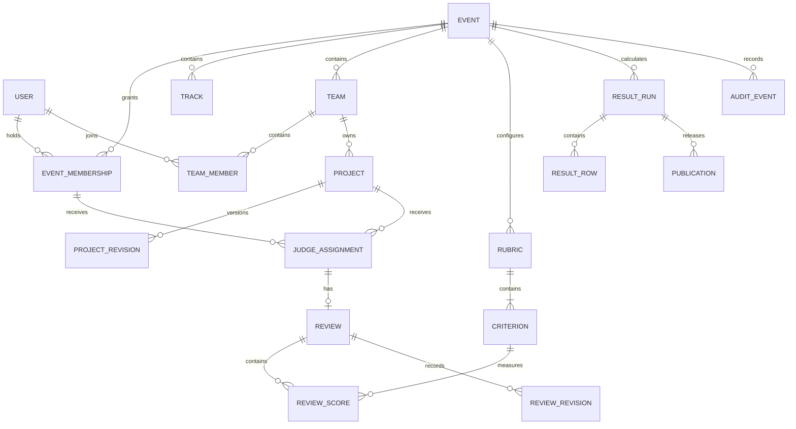

# DATA-MODEL

Status: consolidated implementation contract, 27 September 2026. This is the sole schema specification in the final kit. It includes T1–T4 and supersedes the separate earlier V1/V2 proposals. It is not evidence of implemented or verified features.

Companion: `ARCHITECTURE.md`. Audience: the developer implementing the portal in Antigravity and reviewers evaluating its data integrity.

## 1. Product and scope

The portal manages hackathon events, teams, versioned submissions, private judging and published results. Participants build elsewhere and submit repository links, descriptions and optional files. Organisers author Markdown event pages with local visual assets. Every role receives a next-action summary derived from current state.

The target covers all four tiers. Implement the staged milestones in EXECUTION-PLAN.md: core T1/T2 first, then T3 and T4. Core, T3 and T4 labels indicate when to implement a table, not competing schema versions. Pairwise judging remains an optional bonus outside the required tiers. Do not scaffold unused later-stage infrastructure during the first milestone.

Non-negotiable rules:

1. A participant cannot submit or edit after the submission deadline, including through an already-open form or direct API request.
2. Judges cannot retrieve peer reviews, scores or unpublished rankings.
3. Event roles are scoped to an event, not inferred from a global profile label.
4. A missing review is missing data, never a zero score.
5. Imported duplicates and original fixture values are preserved with explicit disposition.
6. A published result references a reproducible, immutable calculation.
7. All core workflows work without external services.

## 2. Storage conventions

| Concern | Convention |
|---|---|
| Database | PostgreSQL; use the same engine in integration tests |
| Primary keys | UUID, generated server-side; IDs are identifiers, not permission checks |
| Time | Aware UTC timestamps (`timestamptz`); ISO 8601 at the API boundary |
| Display timezone | Event IANA timezone; default `Australia/Melbourne`; preserve UTC fixture dates |
| Mutable rows | `created_at`, `updated_at`; rows edited by clients also have integer `version >= 1` |
| Immutable rows | `created_at` only; corrections create new records |
| Money | Optional integer minor units plus ISO currency code; a prize can instead be descriptive |
| Weights | `numeric(8,4)`, strictly positive; normalise by their sum at calculation time |
| Entered scores | Integers 1 through 5 in the core product; this range is fixed and documented |
| Calculated scores | Double precision plus deterministic full input snapshots; never use rounded display values for computation |
| Text | UTF-8; validated length limits; Markdown source retained; raw HTML disabled |
| Email | Trim and lowercase for account identity; explicitly document this product policy |
| URLs | Only HTTP/HTTPS for repo/demo references; never fetch them automatically |
| JSONB | Immutable snapshots, import payloads and bounded metadata, not a substitute for relational memberships or scores |
| Deletes | Protect historical references. Archive events and deactivate accounts. No broad cascading deletion of judging history |

In the dictionaries below, `?` means nullable. Foreign keys are protected on deletion unless explicitly described otherwise. Every enum is enforced by a database check, not just Django choices. Length limits listed here are product limits, not inferred from the fixture.

### Enforcement layers

- **DB:** uniqueness, foreign keys, row-local checks, non-null fields and permitted enum values.
- **Service:** actor authorisation, cross-table consistency, time windows, aggregate constraints and transitions, inside a transaction.
- **Read policy:** event-scoped querysets and explicit field allowlists, including list, search, detail and export endpoints.

Django `save()` does not automatically call `full_clean()`. Serialiser validation alone is insufficient. All API, import, management-command and administrative mutations must use the same domain services. Joined checks such as “track belongs to this event” are service checks; do not pretend a normal `CheckConstraint` enforces them.

## 3. Core relationships



Some operational relationships are omitted for readability. The dictionaries are authoritative.

## 4. Identity and event access

### `User`

Custom Django user model created in the first migration, using Django's password hashing and authentication machinery.

Fields: `id`, `email` (254), `display_name` (120), `password`, `is_active`, `is_staff`, `is_superuser`, `email_verified_at?`, `created_at`, `updated_at`, Django login metadata.

- DB: unique normalised email.
- A visitor is an unauthenticated request, not a stored role.
- Platform administrator is represented by `is_superuser`. `is_staff` only permits access to authorised maintenance interfaces; it does not grant event access automatically.
- Session records use Django's database session backend. Do not create a second password/token scheme.
- A platform administrator can perform documented maintenance overrides with an audit reason. Such access is never exposed through judge endpoints.
- Fixture accounts have unusable passwords unless deliberately selected as local demo accounts.

### `EventMembership`

Fields: `id`, `event_id`, `user_id`, `role` (`PARTICIPANT`, `JUDGE`, `ORGANISER`), `status` (`ACTIVE`, `SUSPENDED`), `joined_at`, `version`, timestamps.

- DB: unique `(event_id, user_id)`.
- Deliberate core restriction: one role per person per event. A person can organise one event and participate in another. Combining participant and judge roles in the same event is not supported.
- Service: only an organiser/admin can grant staff roles. Self-registration may grant participant only, within the registration window.
- Role changes cannot invalidate existing teams, assignments or completed reviews silently. Reject incompatible changes; use explicit suspension/reassignment workflows.
- An event must retain at least one active organiser. Check under the event lock.
- Suspended membership immediately loses event privileges; historical rows remain.

### `EventInvitation`

Fields: `id`, `event_id`, `invited_email`, `role` (`JUDGE`, `ORGANISER`), `token_digest`, `expires_at`, `accepted_at?`, `accepted_by_id?`, `revoked_at?`, `created_by_id`, timestamps.

- DB: unique token digest; acceptance timestamp and accepter are either both null or both present.
- Generate a cryptographically random bearer token, store only its digest, and show the link to the inviting organiser once. Do not log the raw token.
- Redemption requires a signed-in account with the matching normalised email and an unexpired, unused, unrevoked invitation.
- Redemption, membership creation and audit insertion are atomic. An invitation does not create a new privileged role merely because a caller knows an email address.
- Copyable invitation links are sufficient offline. SMTP is an optional adapter, never a dependency.

### `RateLimitBucket` (core operational table)

Fields: `id`, `scope`, `subject_key`, `window_start`, `count`, `expires_at`. DB: unique `(scope, subject_key, window_start)`; count non-negative. Use atomic PostgreSQL updates for enforced limits across app workers; in-memory counters are insufficient for a multi-worker deployment. Core scopes cover login, invitation redemption and uploads; T3 adds comments and votes. Configure and document limits per action. Expired buckets are safe to delete through maintenance. Hash sensitive subject identifiers rather than storing raw network addresses unnecessarily.

## 5. Event configuration and public content

### `Event`

Fields:

| Field | Type / meaning |
|---|---|
| `id`, `slug` | UUID; unique stable URL slug |
| `name`, `tagline` | Text, 160 and 240 characters |
| `description_md`, `rules_md` | Markdown, each limited to 100,000 characters |
| `cover_asset_id?` | Ready local image from this event |
| `timezone` | Valid IANA name |
| `lifecycle` | `DRAFT`, `PUBLISHED`, `ARCHIVED` |
| `registration_opens_at`, `registration_closes_at` | Participant registration boundaries |
| `submissions_opens_at`, `submissions_closes_at` | Submission boundaries |
| `judging_opens_at`, `judging_closes_at` | Review boundaries |
| `voting_opens_at?`, `voting_closes_at?` | Both null, or both configured for T3 |
| `min_team_size`, `max_team_size` | Positive integers; default 1 and 4, configurable |
| `required_reviews` | Minimum complete reviews per eligible project; default 3 |
| `ranking_scope` | `EVENT` or `TRACK`; chosen before rubric freeze |
| `ranking_method` | `RAW_WEIGHTED_V1` or `RIDGE_JUDGE_OFFSET_V1` |
| `normalisation_lambda` | Positive number, default 5; frozen with rubric |
| `show_public_progress` | Boolean, default false |
| `active_publication_id?` | Currently visible publication belonging to this event |
| `judging_frozen_at?` | Set at first successful publication |
| `data_version` | Monotonic integer, starts at 1; invalidates stale result runs |
| `version`, timestamps | Optimistic edit version and timestamps |

DB checks: each opening precedes its closing; registration closes no later than submissions close; submissions close no later than judging opens; optional voting opens no earlier than submissions close; `1 <= min_team_size <= max_team_size`; `required_reviews >= 1`; lambda positive. Judging and voting may overlap, but result publication waits for both configured windows to close.

Service rules:

- Participants may write only when `lifecycle=PUBLISHED` and `submissions_opens_at <= authoritative_now < submissions_closes_at`.
- Joining/registering is also bounded by its own window. The final team roster freezes at submission close.
- The deadline comparison occurs inside the final database write transaction, after required locks and validation, immediately before the write. Use a fresh database `clock_timestamp()`; PostgreSQL transaction-start time is not sufficient after waiting on a lock.
- At equality with the closing timestamp the write is rejected. No grace period and no client-clock override.
- A write authorised just before the cutoff may finish committing just after it. Define the acceptance instant as the server's final transactional cutoff check, not receipt of the HTTP request or browser click. Keep this transaction short.
- Extensions are explicit organiser actions, with old/new values and a reason audited. They cannot silently reopen an event after review work has started. Reopening a judged event is deferred; reject it in the core product.
- Stage labels and countdowns are calculated from timestamps and lifecycle. Do not store a mutable `current_phase` field that needs a scheduled job to stay correct.
- Any input change affecting eligibility, scoring or publication increments `data_version` in the same transaction.

### `Track`

Fields: `id`, `event_id`, `slug`, `name` (100), `description_md`, `display_order`, timestamps. DB: unique `(event_id, slug)`.

### `Prize`

Fields: `id`, `event_id`, `track_id?`, `name` (120), `description_md`, `amount_minor?`, `currency?`, `display_order`, timestamps.

DB: amount non-negative when present; amount/currency both null or both present. Service: track belongs to event. A numeric rank does not automatically award a prize. At the certificates milestone, AwardDecision records the organiser’s explicit prize decision against a publication; certificates reference that decision.

### `Asset`

Fields: `id`, `event_id`, `uploaded_by_id`, `project_id?`, `purpose` (`EVENT_IMAGE`, `PROJECT_IMAGE`, `PROJECT_FILE`), `storage_key`, `original_name` (255), `mime_type`, `byte_size`, `sha256`, `state` (`STAGED`, `READY`, `REJECTED`), timestamps.

- DB: unique storage key; positive byte size. Service: purpose, actor, event and optional project agree.
- Defaults: 5 MB per JPEG/PNG/WebP image, 20 MB per PDF/ZIP attachment, 50 MB total attachments per project revision. Treat these as configurable product limits. MB means 1,000,000 bytes.
- Random storage keys; user filenames never become paths. Check file signatures, not only the supplied MIME type. Reject HTML, SVG and executable files. Never unpack or execute uploaded archives.
- Serve general files as downloads with `nosniff`; images use a controlled image route. An uploaded file is not public until a public event cover or submitted public revision references it.
- Stage bytes outside the final mutation transaction. Attaching a staged upload requires a fresh deadline/permission check. Uploading before close does not reserve permission to attach it afterwards.
- Interrupted uploads and unreferenced staged files can be removed by an explicit maintenance command after 24 hours. Referenced assets are protected.
- File-size checks and signature validation are not malware scanning; do not claim otherwise.

## 6. Teams and invitations

### `Team`

Fields: `id`, `event_id`, `name` (100), `captain_user_id`, `status` (`ACTIVE`, `WITHDRAWN`), `version`, timestamps.

Service: captain must be an active member of this team. Create the team and captain membership in one transaction. Transfer captainship before allowing the captain to leave. Names need not be globally unique.

### `TeamMember`

Fields: `id`, `event_id`, `team_id`, `user_id`, `joined_at`.

- DB: unique `(event_id, user_id)` and `(team_id, user_id)`; membership is current state. Departures are represented by deletion plus an immutable audit event, not loss of historical submission snapshots.
- Service: team and active participant membership belong to this event; size does not exceed event maximum; roster changes allowed only before submission close and while registration permits joining.
- Use the event/team transaction lock for capacity and one-team checks. DB uniqueness resolves concurrent attempts to join two teams.

### `TeamInvitation`

Fields: `id`, `team_id`, `token_digest`, `invited_email?`, `expires_at`, `accepted_at?`, `accepted_by_id?`, `revoked_at?`, `created_by_id`, timestamps.

- Single-use invite link, optionally email-bound. Unique token digest; same paired acceptance constraint as staff invitations.
- Signed-in participant redeems within the relevant windows. Check capacity and team membership atomically.
- Captain creates/revokes invitations. Any team member can edit the project; only the captain submits or withdraws it. UI must communicate this distinction.

## 7. Projects and immutable submission versions

### `Project`

Fields: `id`, `event_id`, `team_id`, `state` (`DRAFT`, `SUBMITTED`, `WITHDRAWN`, `DISQUALIFIED`, `DUPLICATE`), `draft_revision_id?`, `submitted_revision_id?`, `first_submitted_at?`, `last_submitted_at?`, `duplicate_of_id?`, `disposition_reason?`, `version`, timestamps.

- DB: partial unique `(event_id, team_id)` where state is `DRAFT` or `SUBMITTED`. This permits preserved historical duplicate records without permitting two active live entries.
- DB: submission timestamps are paired; `SUBMITTED` requires a submitted revision; `DUPLICATE` requires a duplicate target and cannot target itself.
- Service: event and team match; both revision pointers belong to this project; duplicate target is in the same event and cannot form a chain/cycle. Historical duplicate/disqualified entries can retain their submitted revisions.
- `DRAFT -> SUBMITTED` requires a complete valid draft, captain permission, team-size compliance and an open submission window.
- Saving after submission creates a new draft revision. The last explicitly submitted revision remains the official entry until the captain resubmits. Display “Unsubmitted changes” clearly.
- At close, the last submitted revision is the entry for judging. A draft-only project is not submitted. A newer unsent draft remains private and read-only.
- Before close the captain may withdraw. Reinstatement is an explicit resubmission within the window. After close, only an organiser can change eligibility with a reason; this cannot change submitted content.
- Duplicate detection raises an organiser-visible flag. It never silently merges or deletes live projects. Once a duplicate disposition is confirmed, it is excluded from ranking and public gallery by default while remaining visible to organisers.

### `ProjectRevision`

Immutable fields: `id`, `project_id`, `number`, `track_id`, `title` (160), `summary` (500), `description_md` (100,000), `repo_url?` (2,048), `demo_url?` (2,048), `roster_snapshot` (user IDs and display names only), `created_by_id?`, `source` (`USER`, `FIXTURE_IMPORT`, `PORTABLE_IMPORT`), `created_at`.

- DB: unique `(project_id, number)`.
- Submission requires title, summary, track and at least one repository link or ready supporting file. Demo URL is optional. Drafts may be incomplete.
- Service: track belongs to the project event; derive the roster on the server at explicit submit/resubmit. If the roster changed since the last draft, create a new revision with the current roster before setting `submitted_revision_id`.
- Never expose private roster identifiers through public serialisers. Public team-member display names are optional product content, not account/email disclosure.
- Optimistic locking uses the parent project's version. A stale save returns 409 and preserves the user's local text; never overwrite a teammate silently.

### `RevisionAsset`

Fields: `id`, `revision_id`, `asset_id`, `caption` (240), `display_order`. DB: unique `(revision_id, asset_id)`. Immutable with the revision. Service: asset is ready, belongs to this project/event and the attachment limits hold.

Gallery queries read submitted revision fields, never unpublished draft fields. Search/filter indexes must follow that rule too.

## 8. Rubrics, assignments and private reviews

### `Rubric`

Fields: `id`, `event_id`, `version_number`, `name`, `state` (`DRAFT`, `FROZEN`), `frozen_at?`, `created_by_id`, timestamps.

DB: unique `(event_id, version_number)` and one frozen rubric per event in the core product. Service: at least one criterion, all weights positive, and a valid ranking configuration before freeze. Freeze before creating the first assignment. The frozen rubric and event ranking configuration are immutable. Rubric replacement after judging starts is deferred; do not mutate previous reviews to fit new criteria.

### `Criterion`

Fields: `id`, `rubric_id`, `key` (64), `label` (120), `description_md`, `weight`, `display_order`, timestamps. DB: unique `(rubric_id, key)`, weight positive. The core score range is 1–5 for every criterion.

### `JudgeTrack`

Fields: `id`, `membership_id`, `track_id`. DB: unique pair. Service: active judge membership and track belong to the same event. These are expertise tags only. They never grant access.

### `JudgeTrackPermission`

Fields: `id`, `membership_id`, `track_id`, `granted_by_id?`, `reason`, `created_at`. DB: unique `(membership_id, track_id)`. Service: active judge membership and track must belong to the same event. Explicit permission is required when assigning and reading/writing reviews. No grant means denial; an event-wide judge receives explicit grants for each track. Grant revocation atomically revokes affected active assignments, invalidates scoring inputs and appends audit. Historical records remain protected.

Imported declared track tags seed initial grants with an import reason. Source reviews outside that initial scope are retained on QUARANTINED assignments, not silently discarded or made visible to a judge. Organisers can inspect and explicitly reconcile them through a reasoned grant/assignment activation action. This preserves source evidence while enforcing the same access checks everywhere.

### `JudgeConflict`

Fields: `id`, `event_id`, `judge_membership_id`, `project_id`, `reason`, `declared_by_id`, `created_at`. DB: unique `(judge_membership_id, project_id)`. Service: matching event and judge role. A declared conflict blocks active assignment; an organiser cannot quietly override it. Replacement assignments and invalidation of affected reviews are audited.

### `JudgeAssignment`

Fields: `id`, `event_id`, `judge_membership_id`, `project_id`, `project_revision_id`, `rubric_id`, `status` (`ACTIVE`, `REVOKED`, `QUARANTINED`), `assigned_by_id?`, `source` (`MANUAL`, `BALANCED`, `FIXTURE_OBSERVED`, `DEMO_SYNTHETIC`), `assigned_at`, `revoked_at?`, `revocation_reason?`, timestamps.

- DB: partial unique `(judge_membership_id, project_id)` where status is active.
- Service: same event across all references; member is an active judge with an explicit JudgeTrackPermission for the pinned revision’s track; no conflict; revision is the official submitted revision; rubric is frozen. QUARANTINED historical assignments are organiser-visible evidence and excluded from active queues/current ranking until explicitly reconciled.
- Create live assignments after submissions close, ensuring every judge reviews the same frozen entry. The fixture importer is a controlled historical import path.
- Revocation does not delete the review. It removes that assignment/review from current ranking inputs and increments event data version.
- `PENDING`, `IN_PROGRESS`, `COMPLETE` are derived from review state rather than stored on the assignment.

### `Review`

Fields: `id`, `assignment_id`, `status` (`DRAFT`, `SUBMITTED`), `comment` (10,000), `submitted_at?`, `version`, timestamps. DB: unique assignment; submitted status requires timestamp.

- Only the assigned judge can write. Organisers may read submitted reviews; drafts and draft scores remain private to the judge. Organisers can see draft/completion status without draft content.
- Draft saves may contain partial scores. Submission requires exactly one score for every criterion in the frozen rubric and no extras.
- Judge edits to a submitted review before judging closes are explicit complete resubmissions, not partial autosave overwrites. Every successful mutation creates a `ReviewRevision`.
- Writes require the judging window to be open, the assignment active, membership active and `judging_frozen_at` null. At/after close, reviews are read-only. Early result publication is prohibited.
- The service derives identity from the session. It never trusts `judge_id`, `author_id` or score ownership supplied by the client.

### `ReviewScore`

Fields: `id`, `review_id`, `criterion_id`, `value`. DB: unique `(review_id, criterion_id)`; integer `1 <= value <= 5`. Service: criterion belongs to assignment rubric. These rows hold the review's current values; prior values live in immutable revisions.

### `ReviewRevision`

Immutable fields: `id`, `review_id`, `number`, `status`, `scores_snapshot` (criterion IDs, keys and integer values), `comment_snapshot`, `actor_user_id?`, `reason?`, `source` (`USER`, `FIXTURE_IMPORT`, `PORTABLE_IMPORT`), `created_at`.

DB: unique `(review_id, number)`. A result run pins the exact submitted revision it used. Judge-facing APIs never expose another judge's revisions. Private comments are not copied into public results or general audit payloads.

## 9. Calculation, publication and reproducibility

### `ResultRun`

Immutable fields: `id`, `event_id`, `source_data_version`, `algorithm_version`, `parameters_json`, `input_snapshot_json`, `input_sha256`, `output_sha256`, `diagnostics_json`, `created_by_id`, `created_at`.

The input snapshot contains stable project/revision IDs and titles, eligibility decisions, rubric weights, submitted review revision IDs and numeric scores, ranking scope, assignment coverage, configured minimum reviews and algorithm parameters. It excludes account emails, invite/session tokens and private comments. Canonical JSON uses sorted keys, stable ID ordering and declared numeric serialisation. A hash checks consistency; it is not a digital signature or proof against a database administrator.

Compute inputs from one consistent database snapshot while holding the event mutation lock briefly; release the lock before calculation. At publication, the run must still match the event's current data version.

### `ResultRow`

Immutable fields: `id`, `result_run_id`, `project_id`, `cohort_key`, `eligible`, `exclusion_reason?`, `completed_review_count`, `assigned_review_count`, `raw_mean?`, `adjusted_value?`, `ranking_value?`, `comparison_component?`, `rank?`, `flags_json`.

- DB: unique `(result_run_id, project_id)`; counts non-negative; ranked rows require eligibility and a numeric ranking value.
- No reviews means null scores and null rank. No invented zeros or random tie breakers.
- Cohort is the whole event for `EVENT` scope or an individual track for `TRACK` scope. No cross-track overall leaderboard is inferred from track-specific scores.
- Rank eligible rows by the selected method's value rounded to six decimal places for tie comparison, descending. Use competition ranks (1, 1, 3). Display may round further but must explain the tie precision. Stable ID ordering is for rendering only, never a tie-breaking award rule.
- Fewer than required reviews, disconnected comparison groups and uncertain fixture coverage are explicit diagnostics. Publication requires them to be resolved or specifically waived with visible limitations. Projects with no complete reviews remain unranked even with a waiver.

### Normalisation contract: `RIDGE_JUDGE_OFFSET_V1`

This is a proposed, testable adjustment model, not a claim to have proved fairness. Implement and document its assumptions in `JUDGING.md` before claiming the normalisation bonus.

For each complete review by judge `j` of project `p`, compute the weighted score:

```text
x[j,p] = sum(weight[c] * score[j,p,c]) / sum(weight[c])
```

For each ranking cohort, fit project values `q[p]` and judge offsets `b[j]` by minimising:

```text
sum over observed reviews (x[j,p] - q[p] - b[j])^2
    + lambda * sum over judges b[j]^2
```

Use lambda = 5 by default, frozen before judging. The penalty shrinks judge adjustments towards zero when evidence is weak. Every completed review has equal weight; criterion weights are applied inside that review. Missing reviews contribute no term.

Deterministic reference solver:

1. Sort project and judge IDs. Initialise every `b[j]=0` and each `q[p]` to its raw mean.
2. Update each `q[p]` to the mean of `x[j,p]-b[j]` over its complete reviews.
3. Update each `b[j]` to `sum(x[j,p]-q[p]) / (n[j]+lambda)`.
4. Repeat until the maximum absolute change in any q or b is below `1e-10`, with a maximum of 10,000 iterations.
5. Record iteration count, final residual, objective and convergence status. Non-convergence blocks publishing this run; never silently swap algorithms.

The objective is strictly convex for the included projects/judges when lambda is positive and each included project has a review; the penalty removes the arbitrary constant shift between project and judge values. Test the iterative output against an independently solved linear system on small examples.

Store raw and adjusted results side by side. Adjusted values are an index on approximately the original scale and can fall outside 1–5; do not clip them or label them as entered rubric scores.

Important limits:

- A constant-scoring judge causes no division by zero because the method does not divide by judge variance.
- One-review judges receive strongly limited corrections; single observations do not establish generosity or harshness reliably.
- The model assumes additive judge bias and cannot fully distinguish bias from assignment difficulty with sparse overlap.
- Find connected components of the judge–project comparison graph. Disconnected groups have no direct calibration evidence between them; the prior provides a numerical anchor, not proof of comparability. Default publication blocks on this warning unless an organiser records a visible waiver.
- Report per-project review count and score spread. Do not present invented confidence intervals.
- A raw-weighted ranking is a legitimate separately configured method. Never change methods after seeing winners without a documented correction process and new result run.

### `Publication`

Immutable fields: `id`, `event_id`, `result_run_id`, `number`, `published_by_id`, `published_at`, `public_note_md`, `waivers_json`, `supersedes_id?`.

- DB: unique `(event_id, number)`.
- Service: result run belongs to event and matches `data_version`; judging window has closed; voting window has closed if configured; hard errors absent; every waivable warning explicitly acknowledged.
- Waivers contain diagnostic codes, affected projects/cohorts, reasons and actor/time. The public limitations section includes relevant ranking/coverage limitations without exposing private judge information.
- Atomically insert publication, update event's active publication pointer, freeze judging, and append audit event.
- Public ranking endpoints serve only the active publication. Organiser previews are private and not cached publicly.
- Corrections create a new result run and superseding publication with a public explanation. Previous publications remain accessible as history. Core corrections can change eligibility or explanatory metadata; changing historical judge scores requires a future explicit amendment workflow.

## 10. Audit, provenance and import

### `AuditEvent`

Immutable fields: `id`, `event_id?`, `actor_user_id?`, `actor_kind` (`USER`, `SYSTEM`, `IMPORT`), `action`, `entity_type`, `entity_id?`, `request_id?`, `before_json?`, `after_json?`, `reason?`, `created_at`.

- Write alongside the domain mutation in the same transaction. If audit insertion fails, the mutation fails.
- Record invitations, role changes, deadline changes, team transitions, explicit submissions, assignment changes, review submission/resubmission, dispositions, exports and publication.
- Review audit payloads include revision IDs and status, not score/comment contents. Invite payloads exclude tokens. Never store passwords, session cookies or full request bodies.
- General organiser audit views show events they manage. Security-denial logging is a separate bounded log to avoid unauthenticated audit-table flooding.
- Read-only application interfaces and optional DB grants protect append-only rows. This is an audit trail, not a tamper-proof ledger against a database owner.

### `ImportBatch`

Fields: `id`, `namespace`, `format_version`, `file_sha256`, `status` (`VALIDATED`, `APPLIED`, `FAILED`), `report_json`, `created_by_id?`, timestamps. DB: unique `(namespace, file_sha256)`.

### `ExternalRecord`

Fields: `id`, `namespace`, `entity_type`, `external_id`, `internal_id`, `original_payload_json`, `import_batch_id`, `created_at`.

- DB: unique `(namespace, entity_type, external_id)`.
- `internal_id` is a UUID resolved by entity type; it is a deliberate provenance mapping rather than a generic business foreign key. Import validation and consistency tests check it resolves.
- Preserve original external string IDs (`evt_01`, `prj_41`, etc.) and source payloads. Do not force them into UUID fields or discard them.
- Scores have no source ID; synthesise a provenance key from `(judge, project)` only after rejecting duplicate source pairs.

### Exact supplied fixture policy

The inspected file has 1 event, 8 tracks, 30 judges, 40 teams, 41 project records and 126 score records. All 41 projects have 2–5 recorded reviews. The file has no explicit assignment or review-batch collection and no rubric weights.

Inspected fixture SHA-256: `252896bc45d49fca69ad413be40c6bfde9d9b9f9dd8db702b3ff74eaaa181121`. If the supplied fixture changes, revalidate the mapping and counts rather than assuming these observations still hold.

1. Validate JSON, known keys, all references, unique source IDs and valid score ranges before writing. Reject unknown criterion keys unless explicitly mapped.
2. Preserve `submissions_close = 2026-03-01T18:00:00Z`. Never move it forward to make the demo convenient.
3. Derive missing opening/registration/judging dates as labelled import defaults. Use historical, closed windows that encompass supplied submission timestamps. Record those defaults in the import report; do not represent them as source facts.
4. Create equal weights for `functionality`, `quality`, `innovation`, each on 1–5. Label these weights as import defaults because the fixture supplies none.
5. Match/create normalised users, create judge memberships and expertise tags, create participant memberships and teams. The first listed team member is a labelled default captain. Missing organiser identity is supplied by the local demo seed, not invented as fixture data.
6. Create an immutable submitted revision for every source project. Keep all 41 project records.
7. The supplied duplicate is `prj_41`, matching the repository of `prj_07` and belonging to `tm_07`. Preserve its own revision, original timestamp and reviews, mark it `DUPLICATE` of `prj_07`, and audit this importer disposition. Exclude it from competitive ranking by default. Do not discard or combine either project's scores.
8. For each observed score, create an assignment with source `FIXTURE_OBSERVED`, a submitted review, criterion scores and an import review revision. The source supplies no review/assignment timestamps: use the import instant for storage timestamps and label original review times unknown in the report. Historical import bypasses live review-window validation only through this privileged service. Preserve source track tags as expertise and initial permitted scope. Quarantine assignments outside that scope and report the exact exclusions, retaining every source score. An organiser can explicitly reconcile grants/assignments with a reason. Do not broaden judge access or rewrite source scores silently.
9. Do not fabricate missing assignments from absent scores. The brief mentions unfinished batches, but their membership cannot be reconstructed from this file. Imported assignment completion is known only for observed assignments; label coverage `UNKNOWN`, not 100%. Derive this diagnostic from import provenance and assignment sources.
10. `jdg_07` has three reviews whose criterion values are all 4. Preserve them and verify finite, reproducible calculations. Other judges with very little data must also be handled.
11. Reimporting the same file is a no-op with a report. A changed file under the same namespace requires explicit reconciliation; never overwrite live user edits at boot.
12. Create a separate clearly named live demo event for open submission/judging examples. Relative demo dates may be set only on its first creation. Restarts do not reset either event's clock.

Apply the fixture in one transaction after validation. Retain the import report if validation fails without partially importing the event. Fixture import is a privileged historical operation, not a public API for bypassing deadlines.

### Portable export/import

Core CSV export is organiser-only, event-scoped and includes declared raw/adjusted values, rubric/algorithm versions, coverage and exclusions. Protect against spreadsheet formula injection in untrusted text fields. Keep a separate faithful JSON export so CSV escaping does not change the archival source.

The adoption package is versioned JSON plus a manifest of media files and SHA-256 digests. Include events, identities necessary to reconnect membership, memberships, teams, project/review revisions, rubric, assignments, results, publication history, provenance and audit history. Exclude password hashes, sessions, invitation tokens, signing keys and deployment secrets. Import creates accounts with unusable passwords and an explicit administrator activation path. It never silently merges users by email across unrelated exports.

Full portable round-trip import/export is a later adoption milestone, not a prerequisite for the first vertical slice. Until implemented, document `pg_dump`/restore plus the media volume as the tested migration/backup path and do not claim portable migration is complete.

## 11. Community schema (T3 milestones)

This is the final voting model. New builds create Vote with voter_identity_id from the start; there is no competing user-only Vote model to implement. Existing user-backed implementations use the migration procedure in ARCHITECTURE.md. Voting behaviours, gates, deadlines and confidentiality are specified in that document.

All new business IDs are UUIDs. UTC timestamps, enum checks, protected historical references and audit rules from `DATA-MODEL.md` continue to apply.

| Entity | Fields and constraints |
|---|---|
| `VotingPolicy` | One per event; `mode` AUTHENTICATED / INVITE_LINK / EMAIL_VERIFIED; `minimum_account_age_seconds >= 0`; `comments_enabled`; `frozen_at?`; `version`; timestamps |
| `VoterIdentity` | `event_id`, `kind`, `user_id?`, `email_digest?`, `link_grant_id?`, `status` ACTIVE/SUSPENDED; timestamps. Exactly one principal appropriate to kind; partial unique event/user, event/email digest and event/link grant |
| `VotingLinkGrant` | `event_id`, unique `token_digest`, optional encrypted recipient label, `expires_at`, `redeemed_at?`, `revoked_at?`, creator and timestamps |
| `EmailChallenge` | `event_id`, encrypted delivery email, keyed email digest, unique token digest, expiry, consumed timestamp, attempt count. Short-lived; remove ciphertext after consumption/expiry |
| `Vote` | `event_id`, `project_id`, required `voter_identity_id`, state ACTIVE/WITHDRAWN/VOID, version and timestamps. Unique `(event_id, project_id, voter_identity_id)` |
| `BallotSession` | `event_id`, `voter_identity_id`, secret random ordering seed, eligible-project snapshot IDs, `created_at`, `expires_at`; one current ballot per identity/event |
| `CommunityResultRow` | Immutable `result_run_id`, `project_id`, `eligible`, `counted_votes`, `excluded_votes`, `rank?`; unique run/project; non-negative counts |

Restrict cross-table checks to transactional services. Do not rely on a row-local CHECK to validate another table's event ID. Digest email identifiers with a keyed HMAC and a documented key version; unsalted email hashes are easy to enumerate. Keep the key in protected deployment configuration.


### `Comment`

Fields: `id`, `event_id`, `project_id`, `author_user_id`, `body` (5,000 plain-text characters), `state` (`VISIBLE`, `HIDDEN`, `DELETED`), `version`, timestamps. Enforce event/project consistency and author membership/account permissions. Create/edit while published and after submissions open, ending at voting close if configured, otherwise judging close. Authors can delete afterwards; organisers can moderate with a reason. Deleted content is removed rather than copied into general audit logs. Signed-in accounts are required even when voting uses link/email credentials.

### `AbuseSignal`

Fields: `id`, `event_id`, `user_id?`, `kind`, `subject_id?`, `network_key?`, `details_json`, `state` (`OPEN`, `REVIEWED`, `DISMISSED`), `reviewed_by_id?`, `reviewed_at?`, `created_at`. Network identifiers are rotating keyed hashes with 30-day default detailed-signal retention. Signals are review evidence, not automatic proof of cheating.

### `ModerationCase`

Fields: `id`, `event_id`, `target_type`, `target_id`, `reason_code`, `reporter_user_id?`, `status` (`OPEN`, `RESOLVED`, `DISMISSED`), `assigned_to_id?`, `decision?`, `decided_by_id?`, `decided_at?`, `created_at`. Validate target type/ID against this event; do not expose arbitrary generic records. Resolve with an audited action that names the affected content/votes and reason.

### Voting/result invariants

- Exactly one current Vote row per event/project/voter identity. ACTIVE counts; WITHDRAWN and VOID do not. An organiser-voided vote cannot be reactivated by its voter.
- VoterIdentity kind/principal checks require one appropriate principal: user for AUTHENTICATED, keyed email digest for EMAIL_VERIFIED, link grant for INVITE_LINK. Every linked record belongs to the same event.
- Freeze policy at/before opening. Authenticate/validate gate, window and project eligibility on every mutation. Gate credentials never grant participant, judge or organiser privileges.
- Public responses include only the actor’s vote state before publication; totals/ranks remain private. Community votes do not change judged rankings.
- BallotSession persists the voter’s shuffled eligible-ID sequence across refreshes and pages. Eligibility updates reconcile the sequence explicitly.
- Snapshot vote policy, eligible projects, vote states and private identity references in ResultRun input; public CommunityResultRow contains aggregate values only. No live-count reads from published results.
- Vote/eligibility/moderation changes affecting outcomes increment Event.data_version. Releasing or correcting results follows the existing Publication model.

## 12. Indexes and query boundaries

Create unique indexes above and normal FK indexes. Add only these initial workload-driven indexes:

| Query | Index / strategy |
|---|---|
| Public event lookup | Unique event slug |
| Public gallery | Project `(event_id, state, last_submitted_at, id)`; join submitted revision only |
| Track filtering | Revision `(track_id, project_id)` |
| User's event role | Unique membership `(event_id, user_id)` |
| Judge work queue | Assignment `(event_id, judge_membership_id, status)` |
| Organiser assignment coverage | Assignment `(event_id, project_id, status)` |
| Review progress | Review `(status, assignment_id)` |
| Audit timeline | Audit `(event_id, created_at, id)` |
| Result display | ResultRow `(result_run_id, cohort_key, rank, project_id)` |
| Token redemption | Unique token digest on each invitation table |
| Expired staging | Asset `(state, created_at)` |

Use paginated gallery queries and eager loading for tracks/team names. At fixture scale, bounded case-insensitive title/summary search is sufficient; add PostgreSQL text-search indexes only after measurement. Do not introduce Elasticsearch. Do not aggregate private scores into a queryset used by public endpoints.

## 13. Transaction and concurrency contract

For the initial event sizes, serialise event-domain mutations with a short `SELECT ... FOR UPDATE` on Event. It provides a simple consistent boundary for deadlines, membership changes, assignment decisions and result invalidation. No file streaming, network requests or normalisation calculation occurs while holding it.

Lock order: Event, then Team/Project as needed, then Assignment/Review, then child rows. Every writer follows the same order. Enforce bounded lock timeouts and return a retryable response; never bypass validation after contention.

Within the transaction: authorise, validate relationships/version, take a fresh database timestamp, enforce the window, update rows, increment versions, append audit, commit. DB unique constraints remain the final defence against duplicate joins/reviews/votes.

Idempotent explicit submission: repeat of the same submitted revision returns the existing receipt; it never creates a second project. A stale client version returns 409. Invite redemption is single-use; repeated redemption by the same account may return the existing membership without creating another one.

If measured write contention becomes a problem, narrow locks with dedicated publication/version coordination and concurrency tests. Do not prematurely replace this understandable model with distributed locks.

## 14. Required integrity tests

1. Boundary: before cutoff succeeds; equal/after cutoff fails; an open browser and a pre-started upload do not bypass it.
2. A lock wait crossing the deadline fails because time is checked after acquisition.
3. Two concurrent team joins cannot exceed capacity or place a person in two teams in one event.
4. Stale project autosave cannot overwrite a teammate's revision.
5. Last submitted revision survives an unfinished newer draft and is the version assigned to judges.
6. Direct calls cannot combine event A's project with event B's track/rubric/judge or asset.
7. Judge B cannot access judge A's list, detail, revisions, comments, score export or aggregate inference endpoints.
8. Submitted review requires all and only the rubric's criteria; scores outside 1–5 fail at DB level.
9. Constant scores, one-review judges, uneven coverage and no-score projects yield defined finite outputs or explicit unranked states.
10. Fixture import preserves 41 projects/126 reviews and the original closed date, identifies the duplicate and is idempotent.
11. Unknown source assignments never appear as known 100% completion.
12. A stale result run cannot publish; public endpoints expose no preview before release.
13. Rollback removes domain mutation and its audit event together; successful changes have both.
14. Backup restore includes media and reproduces a published run's hashes and visible results.

## 15. Implementation notes and documentation basis

Use named Django `UniqueConstraint` and `CheckConstraint` objects for row-level rules; explicitly encode cross-row invariants in domain services. [Django constraints](https://docs.djangoproject.com/en/5.2/ref/models/constraints/).

Use transactional row locks on PostgreSQL for the mutation boundary and real transactional tests for concurrency. [Django QuerySet reference](https://docs.djangoproject.com/en/5.2/ref/models/querysets/#select-for-update).

DRF object permissions do not automatically filter list results or enforce object creation rules. Implement queryset scoping and service-level create validation explicitly. [DRF permissions](https://www.django-rest-framework.org/api-guide/permissions/).

The project-specific policies above are design decisions derived from the supplied DOGFOOD files and the agreed product requirements, not additional organiser mandates.

## 16. Integration and portability schema (T4 milestones)

Use the same UUID/time/audit conventions and event scoping as the core schema. Foreign-key-like IDs inside polymorphic jobs/payloads need explicit service validation; JSON does not authorise access. Core RateLimitBucket is reused by these features.

### `ApiCredential`

Fields: `id`, `owner_user_id`, `event_id`, `label`, `public_prefix`, `secret_digest`, `scopes_json`, `expires_at`, `revoked_at?`, `last_used_at?`, `created_at`. Unique secret digest; event required. Scopes are validated against the fixed allowlist in ARCHITECTURE.md. Store only the digest of a high-entropy token shown once. Effective authority is scope intersected with current owner role, event membership and object access.

### `IdempotencyRecord`

Fields: `id`, `credential_or_actor_key`, `event_id`, `route_key`, `idempotency_key`, `request_sha256`, `response_status?`, `response_json?`, `state` (`PENDING`, `COMMITTED`, `FAILED`), `expires_at`. Unique actor/event/route/key. Expire ordinary entries after 24 hours; durable operation uniqueness remains independent. Authenticate before replaying a response. Same key with different request hash returns 409. A concurrent PENDING operation returns a documented retryable conflict or the existing asynchronous job; it does not run a second mutation.

### Webhooks

| Entity | Fields and constraints |
|---|---|
| `WebhookEndpoint` | Event, URL, allowed event types, encrypted signing secret/key version, status ACTIVE/PAUSED, creator, version, timestamps |
| `DomainEvent` | Immutable UUID, event ID, type, schema version, entity ID, bounded public-safe payload bytes, timestamp. Insert in the same transaction as the business mutation |
| `WebhookDelivery` | Domain event, endpoint, state PENDING/LEASED/RETRY/SUCCEEDED/DEAD/CANCELLED, lifetime attempt count, replay generation, attempts in generation, next attempt, lease owner/until, last status/error class. Unique domain event/endpoint |
| `WebhookAttempt` | Immutable delivery ID, attempt number, start/end, response status, bounded redacted error, request timestamp; unique delivery/attempt number |


WebhookDelivery state transitions and retry budgets are in ARCHITECTURE.md. Store secrets encrypted under a deployment-managed key held outside the DB. Endpoint changes/replay are audited. DomainEvent and delivery rows are inserted atomically with their domain mutation; workers cannot send rolled-back changes.

### `BackgroundJob`

Fields: `id`, `event_id`, `requested_by_id`, `kind`, `parameters_json`, `input_sha256`, `state` (`QUEUED`, `RUNNING`, `SUCCEEDED`, `FAILED`, `CANCELLED`), `lease_owner?`, `lease_until?`, `attempts`, `progress_current`, `progress_total?`, `result_storage_key?`, `result_sha256?`, `error_code?`, `created_at`, `finished_at?`. Non-negative attempts/progress; current <= total when total exists. Job kinds: GENERATE_CERTIFICATES, EXPORT_EVENT, VALIDATE_IMPORT, APPLY_IMPORT. Lease updates use compare-and-set ownership. Worker rechecks requester authority; downloads check current permission.

### Credentials, signatures and awards

| Entity | Fields and constraints |
|---|---|
| `CertificateTemplate` | Event, immutable version, template kind PARTICIPANT/JUDGE/WINNER, title, safe text fields, local logo asset, layout version, creator/time. No user-supplied executable template code |
| `SigningKey` | Unique key ID, issuer ID, algorithm ED25519, public key bytes, external private-key reference (null for imported public-only keys), state ACTIVE/RETIRED/COMPROMISED, created/retired timestamps |
| `IssuedCredential` | Event, subject user, kind, template version, publication ID?, eligibility snapshot, public display-name snapshot, exact payload bytes, signature bytes, key ID, PDF storage key/hash?, issued timestamp. Unique immutable issuance key derived from event/subject/kind/template/publication |
| `CredentialStatusEvent` | Credential, state REVOKED/SUPERSEDED, reason, replacement ID?, actor/time. Append-only |
| `PublicRecordConsent` | Event, subject user, allowed public fields, granted timestamp, withdrawn timestamp?; one current record per event/user |


### `AwardDecision`

Fields: `id`, `publication_id`, `prize_id`, `project_id`, `decided_by_id`, `reason`, `created_at`. Unique publication/prize/project. All references belong to the same event, the project is an eligible result entry, and the actor is its organiser. Issued winner credentials refer to this decision via their eligibility snapshot. Imported public-only SigningKey records cannot issue new local credentials.

### `EmbedConfiguration`

Fields: `id`, `event_id`, `enabled`, `allowed_parent_origins_json`, `theme` (`LIGHT`, `DARK`, `AUTO`), `default_track_id?`, `show_search`, `version`, timestamps. Unique event; origin strings validated; optional track belongs to event. No private API token is placed in a snippet.

### `PortableImportPlan`

Fields: `id`, `job_id`, `archive_sha256`, `source_instance_id`, `format_version`, `preview_json`, `expires_at`, `applied_at?`, `target_event_id?`. Unique successful source-instance/archive-hash operation; explicit cloning uses a separately audited clone identity. Apply requires the same validated immutable archive bytes, current authorisation and an unexpired preview.

### Queue/extension indexes

- WebhookDelivery `(state, next_attempt, lease_until)` and `(endpoint_id, created_at)`; include a creation timestamp on mutable delivery rows.
- BackgroundJob `(state, lease_until, created_at)` and `(event_id, requested_by_id, created_at)`.
- Vote `(event_id, project_id, state)` plus its unique voter constraint.
- Comment `(event_id, project_id, state, created_at)`; ModerationCase `(event_id, status, created_at)`.
- ApiCredential unique secret digest; expiry/revocation checks on each use.
- IssuedCredential `(event_id, subject_user_id, kind)`; status events `(credential_id, created_at)`.
- PortableImportPlan source/hash uniqueness and `(expires_at, applied_at)` for cleanup.

Do not add every index speculatively. These support named application queues/queries; validate query plans on the chosen supported PostgreSQL version.
